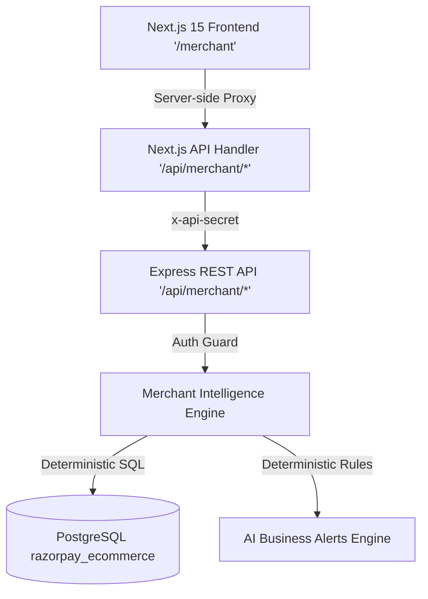

# Merchant AI Phase 2: Merchant Intelligence Dashboard Documentation

## 1. Overview & System Architecture

Phase 2 of **Merchant AI** introduces a dedicated executive dashboard and API ecosystem designed to transform the 12-month PostgreSQL historical e-commerce dataset (15,037 orders, 24,313 line items, 25,687 inventory movements, 40 catalog items, 650 synthetic customers) into real-time, actionable business intelligence.

The architecture is cleanly decoupled into 3 tiers:



---

## 2. Dedicated Merchant Routes & Pages

| Route | Scope | Description |
|---|---|---|
| `/merchant` | Frontend | Executive Merchant Intelligence Hub with dark slate aesthetic, live KPIs, interactive SVG trend charts, catalog tables, inventory radar, and alert center. |
| `/api/merchant/[...path]` | Next.js Proxy | Server-side proxy handler securing client requests to the Express backend while preventing browser leak of `x-api-secret`. |

---

## 3. Backend Merchant API Reference

All endpoints are hosted at `http://localhost:3500/api/merchant/*` and require merchant authorization headers (`x-api-secret` or `x-merchant-role`).

### 1. `GET /api/merchant/overview?period=...`
- **Purpose**: Returns top KPI metrics, month-over-month growth, active customer metrics, and high-priority operational alert counts.
- **Query Params**: `period` (`today`, `last_7_days`, `last_30_days`, `last_90_days`, `this_month`, `last_month`, `this_year`, `last_12_months`).
- **Response**:
  ```json
  {
    "success": true,
    "period": "Last 30 Days",
    "startDate": "2026-07-24",
    "endDate": "2026-08-22",
    "kpis": {
      "grossRevenue": 4253226,
      "netRevenue": 4022144,
      "totalRefunds": 231082,
      "totalOrders": 1088,
      "unitsSold": 2158,
      "averageOrderValue": 3909.22,
      "revenueGrowthPct": 4.89,
      "ordersGrowthPct": 3.42,
      "unitsGrowthPct": 2.47,
      "aovGrowthPct": 1.42,
      "totalCustomers": 658,
      "activeBuyers": 653,
      "repeatCustomerRatePct": 100,
      "averageLifetimeValue": 92107.49,
      "criticalAlertsCount": 2,
      "warningAlertsCount": 3
    }
  }
  ```

### 2. `GET /api/merchant/sales?period=...&interval=...`
- **Purpose**: Returns time-series revenue and volume data points for interactive charting.
- **Interval Options**: `daily`, `weekly`, `monthly`.

### 3. `GET /api/merchant/products?period=...&limit=...&sortBy=...`
- **Purpose**: Returns top performers (Champions) and slow-moving items (Dead Stock).
- **Sort Options**: `revenue`, `units`, `velocity`, `stock`, `returns`.

### 4. `GET /api/merchant/inventory?period=...&threshold=...`
- **Purpose**: Real-time stock velocity, stockout predictions, and automated reorder calculations.
- **Calculations**: `estimatedDaysRemaining = currentStock / dailyVelocity7d`, `restockRecommendedUnits = Math.max(100, velocity * 45 - stock)`.

### 5. `GET /api/merchant/categories?period=...`
- **Purpose**: Merchandise category matrix with revenue share percentages and unit volume.

### 6. `GET /api/merchant/customers?period=...`
- **Purpose**: Customer intelligence, repeat buyer cohorts (VIPs, Frequent, Repeat, One-Time), and CLV distribution.

### 7. `GET /api/merchant/returns?period=...`
- **Purpose**: Return rate, cancellation rate, return reason breakdown, and highest-returned products.

### 8. `GET /api/merchant/alerts`
- **Purpose**: Evaluates live PostgreSQL data to produce prioritized operational alerts.

### 9. `GET /api/merchant/comparison`
- **Purpose**: Multi-period comparative growth analysis (Month-over-Month & Week-over-Week).

---

## 4. UI Components Architecture

All frontend components are located in [storefront/apps/shop/components/Merchant/](file:///d:/Razorpay-Ai-Commerce/storefront/apps/shop/components/Merchant/):

1. **[KpiCard.tsx](file:///d:/Razorpay-Ai-Commerce/storefront/apps/shop/components/Merchant/KpiCard.tsx)**: Glassmorphic KPI cards with animated delta badges and Indian Rupee formatting.
2. **[SalesTrendChart.tsx](file:///d:/Razorpay-Ai-Commerce/storefront/apps/shop/components/Merchant/SalesTrendChart.tsx)**: Interactive SVG chart with hover tooltips, metric toggles (Revenue, Orders, Units), and interval toggles (Daily, Weekly, Monthly).
3. **[ProductPerformanceTable.tsx](file:///d:/Razorpay-Ai-Commerce/storefront/apps/shop/components/Merchant/ProductPerformanceTable.tsx)**: Sortable product table with search, stock health badges, velocity metrics, and return rate indicators.
4. **[InventoryAlertsRadar.tsx](file:///d:/Razorpay-Ai-Commerce/storefront/apps/shop/components/Merchant/InventoryAlertsRadar.tsx)**: Visual inventory radar predicting stockouts and calculating supplier replenishment targets.
5. **[CategorySharePie.tsx](file:///d:/Razorpay-Ai-Commerce/storefront/apps/shop/components/Merchant/CategorySharePie.tsx)**: Category contribution matrix with progress bars and revenue shares.
6. **[CustomerCohortMatrix.tsx](file:///d:/Razorpay-Ai-Commerce/storefront/apps/shop/components/Merchant/CustomerCohortMatrix.tsx)**: Buyer segmentation matrix (VIP, Frequent, Repeat, One-Time) and CLV insights.
7. **[ReturnDiagnostics.tsx](file:///d:/Razorpay-Ai-Commerce/storefront/apps/shop/components/Merchant/ReturnDiagnostics.tsx)**: Fulfillment friction diagnostics with return reasons and cancellation distribution.
8. **[BusinessAlertsList.tsx](file:///d:/Razorpay-Ai-Commerce/storefront/apps/shop/components/Merchant/BusinessAlertsList.tsx)**: Autonomous alerts panel with severity indicators and action buttons.
9. **[ComparisonSystem.tsx](file:///d:/Razorpay-Ai-Commerce/storefront/apps/shop/components/Merchant/ComparisonSystem.tsx)**: Multi-period comparison cards displaying MoM and WoW performance.

---

## 5. Security & Boundary Enforcement

1. **Separate Middleware Boundary**: Express backend uses `merchantAuthGuard` ([middleware/merchant_auth.ts](file:///d:/Razorpay-Ai-Commerce/storefront/apps/ecommerce-backend/middleware/merchant_auth.ts)) to block unauthorized requests with `401 Unauthorized`.
2. **Server-Side API Proxy**: The Next.js frontend proxy ([app/api/merchant/[...path]/route.ts](file:///d:/Razorpay-Ai-Commerce/storefront/apps/shop/app/api/merchant/[...path]/route.ts)) keeps the shared API secret on the server side.
3. **Shopi AI Isolation**: Merchant analytics endpoints are completely isolated from `/api/ai/chat` (customer Shopi AI).

---

## 6. Test Suite & Validation Results

### API Layer Tests (`scratch/test_merchant_dashboard_api.ts`)
```text
Testing GET /api/merchant/overview... ✅ PASSED
Testing GET /api/merchant/sales (daily)... ✅ PASSED
Testing GET /api/merchant/products (top & worst)... ✅ PASSED
Testing GET /api/merchant/inventory... ✅ PASSED
Testing GET /api/merchant/categories... ✅ PASSED
Testing GET /api/merchant/customers... ✅ PASSED
Testing GET /api/merchant/returns... ✅ PASSED
Testing GET /api/merchant/alerts... ✅ PASSED
Testing GET /api/merchant/comparison... ✅ PASSED
Testing GET /api/merchant/overview?period=invalid_xyz (fallback check)... ✅ PASSED
Testing Security Guard 401 Rejection on Unauthorized Request... ✅ PASSED

📊 TEST RESULTS: 11 PASSED | 0 FAILED
```

### TypeScript Validation
- `storefront/apps/ecommerce-backend`: `npx tsc --noEmit` passed with **0 errors**.
- `storefront/apps/shop`: `npx tsc --noEmit` passed with **0 errors**.

### Customer-Side Regression Tests (`scratch/test_customer_side_regression.ts`)
- Product catalog queries: ✅ Operational
- Shopi AI Semantic Matcher & Intent resolution: ✅ Operational
- Real customer accounts & original orders: ✅ 100% Preserved
- Backend health check: ✅ Operational

---

## 7. Next Recommended Phase (Phase 3)

With the historical database foundation (Phase 1) and the Merchant Intelligence Dashboard & API Layer (Phase 2) complete, the platform is ready for **Phase 3: Natural Language Merchant AI Copilot**.
- Equipping the Merchant AI Agent with tool-calling capabilities to invoke the 13 analytics services.
- Real-time conversational interface inside the Merchant OS (e.g. "Which products are at risk of stockout this week?", "What was our highest revenue day during Diwali?", "Suggest discount strategies for slow-moving inventory").
