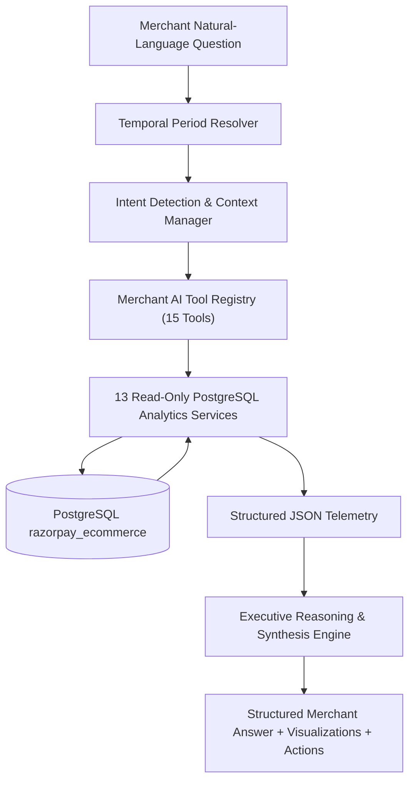

# Merchant AI Phase 3A: Natural-Language Merchant AI Copilot Documentation

## 1. Overview & Architecture

Phase 3A introduces the **Natural-Language Merchant AI Copilot** — an executive conversational intelligence engine that transforms natural-language merchant inquiries into structured, deterministic, PostgreSQL-grounded analytics answers, diagnostic insights, and prioritized business recommendations.

### Core Architectural Principle
The LLM is **strictly prevented** from generating raw SQL or inventing numerical facts. The database remains the immutable source of truth:



---

## 2. Files Created & Modified

### Created Files
- [storefront/apps/ecommerce-backend/merchant-copilot/period-resolver.ts](file:///d:/Razorpay-Ai-Commerce/storefront/apps/ecommerce-backend/merchant-copilot/period-resolver.ts): Normalizes natural-language temporal expressions into SQL date windows and day offsets.
- [storefront/apps/ecommerce-backend/merchant-copilot/copilot-tools.ts](file:///d:/Razorpay-Ai-Commerce/storefront/apps/ecommerce-backend/merchant-copilot/copilot-tools.ts): Controlled tool schemas, execution dispatcher, "Why" multi-dimensional investigator, and priority action synthesizer.
- [storefront/apps/ecommerce-backend/merchant-copilot/MerchantCopilotEngine.ts](file:///d:/Razorpay-Ai-Commerce/storefront/apps/ecommerce-backend/merchant-copilot/MerchantCopilotEngine.ts): Multi-turn conversational copilot engine with deterministic reasoning and Groq/Llama-3.3-70B tool calling.
- [storefront/apps/ecommerce-backend/merchant-copilot/index.ts](file:///d:/Razorpay-Ai-Commerce/storefront/apps/ecommerce-backend/merchant-copilot/index.ts): Barrel export for the Copilot module.
- [storefront/apps/shop/components/Merchant/MerchantCopilotChat.tsx](file:///d:/Razorpay-Ai-Commerce/storefront/apps/shop/components/Merchant/MerchantCopilotChat.tsx): Executive chat UI with message stream, insight callouts, recommendation cards, quick prompts, and action buttons.
- [scratch/test_merchant_ai_copilot.ts](file:///d:/Razorpay-Ai-Commerce/scratch/test_merchant_ai_copilot.ts): 18-point automated test suite for the Merchant Copilot.
- [docs/merchant-ai-phase-3a.md](file:///d:/Razorpay-Ai-Commerce/docs/merchant-ai-phase-3a.md): Comprehensive Phase 3A technical documentation.

### Modified Files
- [storefront/apps/ecommerce-backend/merchant-intelligence/product-analytics.ts](file:///d:/Razorpay-Ai-Commerce/storefront/apps/ecommerce-backend/merchant-intelligence/product-analytics.ts): Added `getProductDetails()` for single product lookups by name or ID.
- [storefront/apps/ecommerce-backend/merchant-intelligence/index.ts](file:///d:/Razorpay-Ai-Commerce/storefront/apps/ecommerce-backend/merchant-intelligence/index.ts): Exported `getProductDetails()`.
- [storefront/apps/ecommerce-backend/routes/merchant.ts](file:///d:/Razorpay-Ai-Commerce/storefront/apps/ecommerce-backend/routes/merchant.ts): Mounted `POST /api/merchant/ai/chat` protected by `merchantAuthGuard`.
- [storefront/apps/shop/app/api/merchant/[...path]/route.ts](file:///d:/Razorpay-Ai-Commerce/storefront/apps/shop/app/api/merchant/[...path]/route.ts): Added `POST` proxy method forwarding requests with server-side `x-api-secret`.
- [storefront/apps/shop/app/merchant/page.tsx](file:///d:/Razorpay-Ai-Commerce/storefront/apps/shop/app/merchant/page.tsx): Integrated `MerchantCopilotChat` interface with toggle and quick-jump navigation.

---

## 3. Merchant AI Capabilities & Tool Registry

The Copilot operates through 15 controlled tools:

| # | Tool Name | Scope & Data Returned |
|---|---|---|
| 1 | `get_sales_overview` | Gross revenue, net revenue, total orders, units sold, AOV, refunds, MoM growth |
| 2 | `get_sales_trends` | Daily, weekly, or monthly time-series trend data |
| 3 | `get_period_comparison` | Month-over-Month (MoM) or Week-over-Week (WoW) financial comparisons |
| 4 | `get_top_products` | Top revenue-generating products, unit volume, and velocity |
| 5 | `get_slow_moving_products` | Slow-moving items, low turnover rate, and potential dead stock |
| 6 | `get_product_details` | Deep-dive telemetry on a single product by title or ID |
| 7 | `get_inventory_status` | Catalog-wide stock levels and inventory health |
| 8 | `get_inventory_risk` | Critical stockout risks ($< 14$ days remaining) and recommended reorders |
| 9 | `get_category_performance` | Merchandise category breakdown, revenue share %, and unit volume |
| 10 | `get_customer_metrics` | Active buyers, repeat purchase rate, and customer lifetime value (CLV) |
| 11 | `get_customer_segments` | Buyer cohorts (VIP 16+, Frequent 6-15, Repeat 2-5, One-Time 1) |
| 12 | `get_return_metrics` | Overall return rate, refund sums, and return reasons breakdown |
| 13 | `get_cancellation_metrics` | Cancellation rate and pre-fulfillment cancellation reasons |
| 14 | `get_business_alerts` | Deterministic operational alerts (Critical, Warning, Opportunity, Info) |
| 15 | `investigate_why_sales_changed` | Multi-dimensional diagnostic engine answering "Why" questions |
| 16 | `get_business_priorities` | Ranked daily operational action items |

---

## 4. Supported Natural-Language Intents

1. `sales_performance`: *"How are my sales doing this month?"*, *"What was my revenue in July?"*
2. `period_comparison`: *"Compare this month with last month"*, *"Is my store improving?"*
3. `top_products`: *"Which products sell the most?"*, *"What's my best-selling product?"*
4. `slow_products`: *"Which products are not selling?"*, *"What items are dead stock?"*
5. `inventory_risk`: *"Which products need restocking?"*, *"What is running out?"*
6. `inventory_status`: *"How much stock do I have?"*, *"Show inventory breakdown"*
7. `category_performance`: *"Which category makes the most money?"*, *"Category share"*
8. `customer_metrics`: *"How many customers bought this month?"*, *"Average customer spend"*
9. `customer_segments`: *"How many repeat customers do I have?"*, *"Who are my VIP buyers?"*
10. `return_analysis`: *"What's my return rate?"*, *"Why are customers returning products?"*
11. `why_diagnostic`: *"Why did sales change?"*, *"Why did revenue increase?"*
12. `business_priorities`: *"What should I focus on today?"*, *"What are my top priorities?"*

---

## 5. Security & Boundary Enforcement

- **Route Protection**: `POST /api/merchant/ai/chat` is protected by `merchantAuthGuard`, enforcing `x-api-secret` or authenticated merchant role tokens.
- **Shopi AI Isolation**: Complete isolation from public customer route `/api/ai/chat`.
- **Zero Information Leakage**: No internal database connection details or raw SQL are returned in API payloads.

---

## 6. Verification & Automated Test Results

### 18-Point Copilot Test Suite (`scratch/test_merchant_ai_copilot.ts`)
```text
Testing: 1. "How are my sales this month?"... ✅ PASSED
Testing: 2. "How much revenue did I make last month?"... ✅ PASSED
Testing: 3. "Compare this month with last month"... ✅ PASSED
Testing: 4. "Which products sell the most?"... ✅ PASSED
Testing: 5. "Which products are not selling?"... ✅ PASSED
Testing: 6. "Which products need restocking?"... ✅ PASSED
Testing: 7. "What is running out?"... ✅ PASSED
Testing: 8. "Why did sales change?"... ✅ PASSED
Testing: 9. "Which category performs best?"... ✅ PASSED
Testing: 10. "How many repeat customers do I have?"... ✅ PASSED
Testing: 11. "What's my return rate?"... ✅ PASSED
Testing: 12. "What should I focus on today?"... ✅ PASSED
Testing: 13. Multi-Turn Context Follow-Up Flow... ✅ PASSED
Testing: 14. Security Guard 401 Rejection on Unauthorized Request... ✅ PASSED
Testing: 15. Merchant Scope & Data Boundary Isolation... ✅ PASSED
Testing: 16. Empty / Whitespace Query Handling... ✅ PASSED
Testing: 17. Invalid / Arbitrary Period Expression Fallback... ✅ PASSED
Testing: 18. Error & Edge Case Resilience... ✅ PASSED

📊 TEST RESULTS: 18 PASSED | 0 FAILED
```

### TypeScript Validation
- `storefront/apps/ecommerce-backend`: `npx tsc --noEmit` passed with **0 errors**.
- `storefront/apps/shop`: `npx tsc --noEmit` passed with **0 errors**.

### Regression Verification
- **Merchant Dashboard API Suite** (`scratch/test_merchant_dashboard_api.ts`): ✅ 11/11 Passed (100%)
- **Customer-Side Shopi Suite** (`scratch/test_customer_side_regression.ts`): ✅ 100% Operational
- **Backend Express Server Health**: ✅ Live & Healthy on port 3500 (`http://localhost:3500/health`)

---

## 7. Example Conversations

### Example 1: Executive Sales Overview
> **Merchant**: *"How are my sales doing this month?"*  
> **Copilot**:
> Here is your business performance summary for **This Month (Current Month MTD)**:
> • **Gross Revenue:** ₹42,53,226  
> • **Net Revenue:** ₹40,22,144 (Refunds: ₹2,31,082)  
> • **Total Orders:** 1,088 orders  
> • **Units Sold:** 2,158 units  
> • **Average Order Value (AOV):** ₹3,909.22  
> 
> 💡 *Key Business Insights:*  
> • Average basket value is ₹3,909.22 across 1,088 completed orders.  
> • Net revenue retention is 94.6% after accounting for returns.  
> 
> 🎯 *Recommended Operational Actions:*  
> → Monitor weekly velocity to detect demand shifts early.  
> → Review top product stock to avoid stockouts during high-traffic windows.

### Example 2: Multi-Turn Diagnostic Follow-Up
> **Merchant**: *"Why did sales change?"*  
> **Copilot**:
> **Business Performance Diagnostic (Last 30 Days):**  
> Revenue changed **+4.89%** compared to prior period.  
> 
> **Key Drivers Identified:**  
> • Order volume surged +3.42% (1,088 orders vs 1,052)  
> • Average order value increased +1.42% to ₹3,909.22  
> • Top product "Smart Watche Vital Plus" generated ₹5,93,802 with 6.67/day velocity  
> 
> 💡 *Key Business Insights:*  
> • Revenue momentum was primarily influenced by strong order volume and champion product velocity.  
> 
> 🎯 *Recommended Operational Actions:*  
> → Double down on marketing spend for top-performing items.

### Example 3: Daily Priorities & Inventory Radar
> **Merchant**: *"What should I focus on today?"*  
> **Copilot**:
> **Today's Prioritized Operational Action Items:**  
> 1. **[CRITICAL] Restock Imminent Out-of-Stock: Smart Watch Vital Plus**  
>    • Only 177 units left (~6 days remaining at 6.03/day velocity).  
>    • *Action:* **Trigger purchase order for +100 units immediately.**  
> 2. **[OPPORTUNITY] Strong Demand Surge: Mens Winter Leathers Jackets**  
>    • Revenue surged +21.4% month-over-month.  
>    • *Action:* **Feature in promotional hero banners and verify supplier supply chain.**  
> 3. **[WARNING] Audit High Return Product: Womens Party Wear Shoes**  
>    • Return rate is elevated at 9.07% with ₹1,54,609 in refunds.  
>    • *Action:* **Review size descriptions and product quality logs.**

---

## 8. Next Recommended Phase (Phase 3B)

- **Interactive Merchant Actions with Human Confirmation**:
  - One-click purchase order generation for critical inventory.
  - One-click promotional coupon code creation for slow-moving dead stock.
  - Automated merchant email summary digests dispatched weekly.
