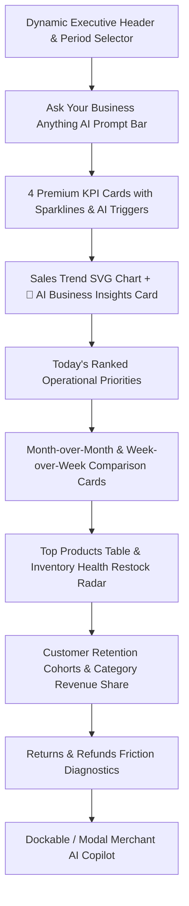

# Merchant AI Phase 3B: Premium Merchant Analytics Dashboard + AI Copilot Documentation

## 1. Overview & Visual Architecture

Phase 3B transforms the Merchant Intelligence Hub into a **production-quality modern SaaS analytics command center**. Built around the philosophy of **Sales (What) → Analytics → Explanation (Why) → Recommendation → Action (What Next)**, the interface seamlessly unites high-density telemetry with contextual AI reasoning.

### Aesthetic Design Tokens:
- **Backdrop**: Crisp, clean light background (`bg-slate-50`).
- **Typography**: High-contrast, dark slate typography (`text-slate-900`, `text-slate-700`).
- **Surface Elevation**: Soft white cards (`bg-white`), subtle 1px borders (`border-slate-200/90`), gentle shadows (`shadow-sm`).
- **Accent Color**: Executive emerald (`emerald-600` / `emerald-700`).
- **Spacing**: Consistent 8px spacing rhythm with generous whitespace and clear visual hierarchy.

---

## 2. Dashboard Layout & Surface Architecture

---

## 3. Core Modules & Feature Breakdown

### 1. Dynamic Header & Period Normalizer
- Greeting: *"Good morning, Merchant 👋"* with dynamic 1-sentence performance summary.
- Global Period Selector: *Today, Last 7 Days, This Month, Last Month, Last 90 Days, Last 12 Months*.
- PostgreSQL sync badge showing 15,037 reconciled orders.

### 2. "Ask your business anything" AI Prompt Bar
- Prominent input field with quick prompt pills (*"How are my sales this month?"*, *"Compare this month with last month"*, *"Which products sell the most?"*, *"Which products need restocking?"*, *"What should I focus on today?"*, *"Why did sales change?"*).

### 3. Four Premium KPI Cards with Sparklines & AI Links
- **Gross Revenue**: Large INR value, MoM growth badge, positive SVG sparkline, *"Why did my revenue change? →"*.
- **Net Revenue**: Large INR value, refund sum subtitle, *"What is the impact of returns and refunds? →"*.
- **Completed Orders**: Order volume, unit count subtitle, *"How are my orders trending? →"*.
- **Average Order Value (AOV)**: AOV value, growth percentage, *"How can I increase my AOV? →"*.

### 4. Sales Performance Chart & 🤖 AI Business Insights Card
- **Sales Performance**: Responsive SVG time-series chart with metric toggles (*Revenue*, *Orders*, *Units*, *AOV*), interval toggles (*Daily*, *Weekly*, *Monthly*), gridlines, and hover tooltips.
- **🤖 AI Business Insights Card**: Autonomous summary derived from live database metrics explaining the primary driver (e.g. order volume +3.42%), secondary driver (AOV +1.42%), top product champion, and operational next steps.

### 5. Today's Operational Priorities Feed
- Ranked priority cards categorized by severity (🔴 Critical, 🟠 Warning, 🟢 Opportunity, 🟡 Info) with recommended actions and direct *"Investigate"* buttons.

### 6. Top Products & Inventory Health Restock Radar
- **Top Products Table**: Top Champions vs Slow-Moving tabs, search bar, stock runway countdown, and *"Why are these products performing well? →"*.
- **Inventory Health Radar**: Status counters (Healthy, Low Stock, Critical, Out of Stock) and replenishment table with 7-day velocity and recommended reorders.

### 7. Customer Retention & Category Share
- **Customer Retention Cohorts**: Active buyers, repeat purchase rate (100%), average CLV, and buyer segmentation table (VIPs, Frequent, Repeat, One-Time).
- **Category Performance**: Clean horizontal bar chart with revenue share % and unit volumes.

### 8. Returns & Refunds Diagnostics
- Overall return rate %, refund sums, cancel rate %, and return reasons breakdown bars.

### 9. Dockable Merchant AI Copilot Drawer
- Dockable drawer triggered from any card's AI link or prompt bar, maintaining multi-turn conversational context.

---

## 4. Verification & Validation Summary

### 18-Point Copilot Test Suite (`scratch/test_merchant_ai_copilot.ts`)
- **18 / 18 Tests Passed (100% Success)**

### Merchant Dashboard API Test Suite (`scratch/test_merchant_dashboard_api.ts`)
- **11 / 11 Tests Passed (100% Success)**

### Customer-Side Regression Test Suite (`scratch/test_customer_side_regression.ts`)
- **100% Operational** (Shopi semantic matcher, product discovery, cart, customer authentication, Razorpay payment flows).

### TypeScript Validation
- `storefront/apps/shop`: `npx tsc --noEmit` passed with **0 errors**.
- `storefront/apps/ecommerce-backend`: `npx tsc --noEmit` passed with **0 errors**.
