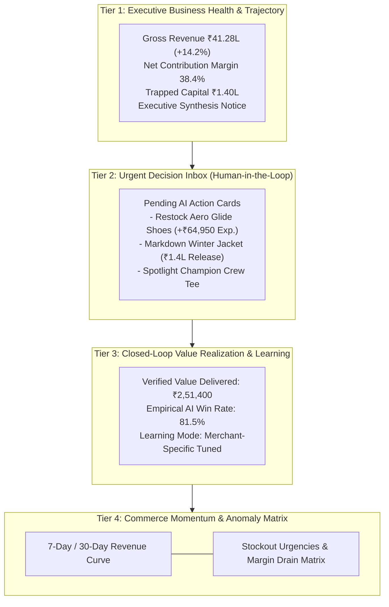

# Merchant AI Platform: Final Design Direction & Commerce Intelligence Blueprint

> **Product**: Razorpay AI Commerce — Merchant Intelligence Operating System  
> **Core UX Philosophy**: Closed-Loop Decision Lifecycle (`Observe` &rarr; `Insight` &rarr; `Prescription` &rarr; `Approval` &rarr; `Execution` &rarr; `Outcome` &rarr; `Value` &rarr; `Learning`)  
> **Design Framework**: Modern High-Density Executive Workspace (Zero Fluff, 100% Grounded Telemetry)  
> **Date**: August 2026  

---

## 1. The Core UX Paradigm Shift

```
[ Traditional Analytics Dashboard ]               [ Commerce Intelligence OS ]
- Disconnected charts                              - Unified business health narrative
- Passive tables of raw numbers                    - High-conviction prescriptive recommendations
- Merchant figures out what to do                  - Grounded evidence chain with projected ROI
- Zero post-decision outcome tracking              - Closed-loop value delivery ledger & model learning
- Manual cross-page investigation                  - 10-second executive scan & 1-click action governance
```

---

## 2. The 10-Second Executive Flow for `/merchant` Overview

The redesigned Overview is structured into 4 distinct cognitive tiers:



---

## 3. Structural Breakdown of Redesigned Overview Components

### A. Tier 1 — Executive Business Health Posture
- **Aggregate Revenue & Margin**: Gross revenue with clean trend delta percentage and contribution margin health indicator.
- **Capital Liquidity**: Highlights trapped cash in stagnant inventory (>30 days non-moving).
- **AI Executive Synthesis Banner**: Compact, high-signal narrative explaining the primary revenue driver and critical operational bottleneck.

### B. Tier 2 — Action Decision Inbox (Front-and-Center Governance)
- Directly elevates pending AI recommendations above passive data tables.
- **Card Anatomy**:
  - `Header`: Action Type badge (`RESTOCK`, `DISCOUNT`, `PROMOTION`), Target Product, and Model Confidence badge.
  - `Evidence Strip`: Pre-decision stock on hand, 7-day velocity, and estimated days of cover.
  - `Economic Impact`: Projected incremental revenue (`+₹64,950`).
  - `Governance Controls`: Direct `Approve & Execute` button and `Review Rationale` drawer trigger.

### C. Tier 3 — Value Realization & Learning Calibration Bar
- Visually connects approved actions with empirical outcome receipts.
- Displays total verified value created, positive outcome rate (%), and active observation window counters.
- States the active learning model state (`GLOBAL BASELINE` vs `MERCHANT-SPECIFIC TUNED`).

### D. Tier 4 — Revenue Momentum & Actionable Anomaly Matrix
- **Interactive Revenue Trajectory**: Visualizes daily/weekly sales velocity compared against prior period.
- **Operational Anomaly Matrix**:
  - *Immediate Stockout Exposure*: Critical SKUs with <5 days cover and quantified daily revenue at risk.
  - *Stagnant Capital Recovery*: Dead inventory with zero velocity and suggested clearance markdowns.

---

## 4. Modern High-Density Visual Aesthetic Rules

1. **Typography**: Structured Inter font hierarchy with monospace numerals (`font-mono`) for exact tabular scanning of financial currencies (`₹`) and percentages (`%`).
2. **Color Semantics**:
   - `Indigo / Slate`: Standard executive UI and AI intelligence accents.
   - `Emerald`: Profitable growth, positive realized outcomes, and healthy margins.
   - `Amber`: Urgent attention required, pending human approvals, and stockout warnings.
   - `Rose`: Margin compression, high return spikes, and underperforming anomalies.
   - `Purple`: Transactional rollbacks and historical baseline reversions.
3. **Information Density**: Tight vertical padding (`py-3`, `px-4`), high visual contrast, and clear micro-borders (`border-slate-200`) without decorative gradients or unnecessary whitespace.
4. **Responsive Adaptability**:
   - 1440px / 1280px: Full multi-column executive command center.
   - 1024px / 768px: Intelligent 2-column wrapping and collapsible sidebar.
   - 390px Mobile: Vertical action stack with touch-optimized 44px tap targets.
