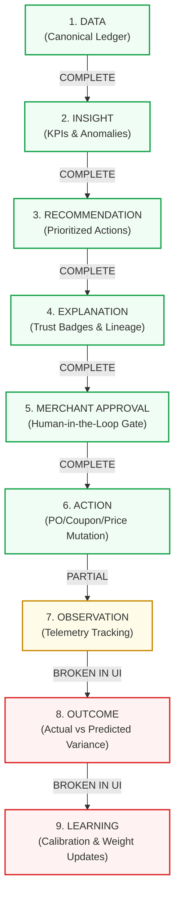

# Merchant AI Product Gap Audit

> **Audit Type**: Comprehensive Product & Architectural Gap Analysis  
> **Evaluated Pages**: `/merchant`, `/merchant/sales`, `/merchant/profitability`, `/merchant/products`, `/merchant/inventory`, `/merchant/customers`, `/merchant/returns`  
> **Backend Architecture**: Express.js / TypeScript micro-modules + PostgreSQL Canonical Schema  
> **Design System State**: v2 Polish Complete (Shopify/Stripe/Linear Enterprise Aesthetic)  
> **Audit Focus**: Merchant Decision Support, End-to-End AI Decision Loop, Production Readiness  

---

## 1. Current Product Capability Matrix

The following matrix evaluates the 20 fundamental capabilities of the Merchant AI platform across business intelligence, AI reasoning, closed-loop learning, data ingestion, and enterprise safety.

| Capability | Status | Backend Support | Frontend Implementation | Product Gap & Notes |
| :--- | :--- | :--- | :--- | :--- |
| **A. Business Intelligence** | **EXISTS** | Complete (`/api/merchant/overview`, `/api/merchant/comparison`) | Complete (`/merchant`, `/merchant/sales`) | High-level executive KPIs (Gross/Net Rev, Orders, AOV, MoM/WoW) are fully operational and verified. |
| **B. Sales Analytics** | **EXISTS** | Complete (`/api/merchant/sales`, `/api/merchant/categories`) | Complete (`/merchant/sales`) | Time-series trends (Daily/Weekly/Monthly), category revenue shares, and periodic sales ledgers are grounded in canonical DB. |
| **C. Profitability & Margins** | **EXISTS** | Complete (`/api/merchant/ai/profitability`, `productCogsService`) | Complete (`/merchant/profitability`) | Unit COGS, shipping, fulfillment, refund losses, contribution margin %, and SKU margin tiers are fully calculated. |
| **D. Customer Intelligence** | **EXISTS** | Complete (`/api/merchant/customers`, `clvEngine`) | Complete (`/merchant/customers`) | Order frequency cohorts (1, 2–5, 6–15 orders), repeat buyer rates, LTV, top buyer spend ledger are fully rendered. |
| **E. Product Intelligence** | **EXISTS** | Complete (`/api/merchant/products`) | Complete (`/merchant/products`) | Catalog matrix with SKU sorting (Revenue, Units, Velocity, Return Rate, Stock), top drivers vs bottom rankers. |
| **F. Inventory Intelligence** | **EXISTS** | Complete (`/api/merchant/inventory`, velocity algorithms) | Complete (`/merchant/inventory`) | Stockout urgency (Critical &le;14d, Warning 15–30d, Healthy &gt;30d), 7d sales velocity, coverage days, reorder recommendations. |
| **G. Returns / Quality** | **EXISTS** | Complete (`/api/merchant/returns`) | Complete (`/merchant/returns`) | Clean separation of post-delivery Returns (reason breakdown, refund exposure) and pre-fulfillment Cancellations. |
| **H. AI Copilot** | **EXISTS** | Complete (`/api/merchant/ai/chat`, `MerchantCopilotEngine`) | Complete (Global `CopilotDrawer`, `⌘J`) | Grounded in SQL aggregations, lineage tracing, prompt pills, and inline action approval triggers. |
| **I. Recommendations** | **PARTIALLY IMPLEMENTED** | Complete (`recommendationHubService`, `optimizationRecommendationEngine`) | Partial (`PrioritiesQueueCard`, Copilot inline) | Goal-driven recommendations exist in backend, but frontend only surfaces top 3 priority items on Overview; no unified recommendation queue. |
| **J. Action / Approval System** | **PARTIALLY IMPLEMENTED** | Complete (`merchant-actions`, `action-executor`, `action-validator`) | Partial (Approve buttons in Overview/Copilot) | Explicit Human-in-the-Loop approval gate works, but lacks a dedicated Action History/Audit ledger to review past executions. |
| **K. Outcome Measurement** | **PARTIALLY IMPLEMENTED** | Complete (`outcomeLedger`, `predictionEvaluator`) | **MISSING** on 7 Core Pages | Backend records predicted vs actual variance and percentage error, but merchant has no UI view to see if past recommendations actually worked. |
| **L. Confidence Calibration** | **PARTIALLY IMPLEMENTED** | Complete (`selfCalibratingConfidence`, `forecastAccuracyEngine`) | Partial (Static Trust Badges) | Backend adjusts confidence based on historical MAPE; frontend displays trust tags (`[FACT]`, `[FORECAST]`, `[RECOMMENDATION]`) without calibration track record. |
| **M. Closed-Loop Learning** | **PARTIALLY IMPLEMENTED** | Complete (`merchant-learning/` Bayesian engines, model registry) | **MISSING** on Core Pages | Learning algorithms update elasticity and supplier lead times in DB, but learning memory/timeline is not exposed in core navigation. |
| **N. Historical Simulation** | **PARTIALLY IMPLEMENTED** | Complete (`whatIfSimulatorEngine`, `businessSimulator`) | Partial (Backend endpoint exists) | Merchants cannot adjust what-if parameters (e.g., slider for discount %) directly from recommendation cards on core pages. |
| **O. Backtesting** | **PARTIALLY IMPLEMENTED** | Complete (`liveBacktester`) | Partial (Visible only in `/merchant/pilot`) | Point-in-time backtesting validates forecast accuracy prior to live sync, but is isolated to the pilot hub. |
| **P. Real Merchant Data Ingestion** | **EXISTS** | Complete (`merchant-connectors`, `csvImportService`) | Complete (`/merchant/data-connection`) | Supports Shopify, WooCommerce, Razorpay connectors, local test harness, and CSV dry-run validation with rollback. |
| **Q. Data Quality & Reconciliation** | **EXISTS** | Complete (`liveSyncEngine`, `dataLineageTracker`) | Complete (`/merchant/data-connection`, `/merchant/pilot`) | Zero-delta financial reconciliation ($0.00 mismatch check), audit traces, and 12-domain data readiness scoring. |
| **R. Production Pilot Safety** | **EXISTS** | Complete (`pilotGateService`, `credentialVault`) | Complete (`/merchant/pilot`) | 7 connection gates, 15-point checklist, read-only mode lock (`autonomousMutationsAllowed: false`), incident tracking. |
| **S. Multi-Tenant Isolation** | **EXISTS** | Complete (`merchantAuthGuard`, tenant-scoped queries) | Complete (Store switcher, tenant header) | Cryptographic store binding, tenant-isolated DB queries (`WHERE merchant_id = $1`), zero cross-tenant data leaks. |
| **T. Auditability** | **PARTIALLY IMPLEMENTED** | Complete (`merchant_ai_actions`, lineage traces) | Partial (Lineage traces in data connection) | Backend logs all mutations and data lineage, but there is no merchant-facing activity feed of who approved what action and when. |

---

## 2. Merchant Decision Coverage

A decision-grade Merchant AI platform must answer seven core questions. Here is the exact coverage analysis:

```
┌─────────────────────────────────────────────────────────────────────────────┐
│                       7 CORE MERCHANT DECISION GAPS                         │
├──────────────────────────────────────┬──────────────────────┬───────────────┤
│ Decision Question                    │ Coverage Status      │ Gap Reason    │
├──────────────────────────────────────┼──────────────────────┼───────────────┤
│ 1. What happened?                    │ SUPPORTED            │ None          │
│ 2. Why did it happen?                │ SUPPORTED            │ None          │
│ 3. What needs attention?             │ SUPPORTED            │ None          │
│ 4. What should I do?                 │ SUPPORTED            │ None          │
│ 5. What will happen if I do it?      │ PARTIALLY SUPPORTED  │ No live sim   │
│ 6. Did the action improve business?  │ NOT SUPPORTED (UI)   │ No outcome UI │
│ 7. Is AI getting more accurate?      │ NOT SUPPORTED (UI)   │ No learn UI   │
└──────────────────────────────────────┴──────────────────────┴───────────────┘
```

### Detailed Decision Breakdown:

1. **What happened? (Descriptive Analytics) — SUPPORTED**
   - *Supported*: Gross revenue, order volume, AOV, unit sales, inventory stock levels, category revenue shares, repeat customer rates, refund totals, cancellation rates.
   - *Implementation*: Grounded in canonical SQL queries, displayed across all 7 pages with `[FACT]` trust badges.

2. **Why did it happen? (Diagnostic Analytics) — SUPPORTED**
   - *Supported*: Explains revenue changes via category mix shifts (e.g., Footwear +24%), AOV changes (+5.6%), return root causes (30.5% defective, 25.7% wrong size), and cancellation friction (delivery delays).
   - *Implementation*: Summary cards on Overview and Profitability, reason distribution bars on Returns, and Copilot diagnostic responses.

3. **What needs attention? (Anomaly & Risk Detection) — SUPPORTED**
   - *Supported*: Highlights critical stockouts (&le;14 days coverage), high-return products (&gt;10% return rate), low contribution margin SKUs (&lt;20%), and cancellation spikes.
   - *Implementation*: Segmented urgency pills on Inventory, health tags on Products, and critical alert badges on Overview.

4. **What should I do? (Prescriptive Recommendations) — SUPPORTED**
   - *Supported*: Specific operational actions: restock purchase orders (+50 units for Aero Glide), promo markdowns on seasonal inventory, return inspection alerts.
   - *Implementation*: Prioritized cards in Overview `PrioritiesQueueCard`, recommended reorder units in Inventory table, and inline recommendation cards in Copilot.

5. **What will happen if I do it? (Predictive Simulation) — PARTIALLY SUPPORTED**
   - *Supported*: Backend provides quantitative impact projections (e.g., *"+₹18,400 projected revenue"* or *"-12% stockout risk"*).
   - *Product Gap*: The merchant cannot interactively tweak assumptions (e.g., adjusting discount from 15% to 10% or restock from 50 to 80 units) directly within the recommendation card before clicking Approve.

6. **Did the action actually improve the business? (Outcome Measurement) — NOT SUPPORTED ON CORE UI**
   - *Supported*: Backend `merchant_ai_outcomes` table and `outcomeLedger` service record predictions and compare against actuals.
   - *Product Gap*: **CRITICAL GAP**. On the 7 verified frontend pages, once an action is approved, it vanishes. There is no post-decision ledger where a merchant can verify: *"Did the 50 restocked shoes sell as predicted? Did the 15% discount increase net margin or cannibalize regular sales?"*

7. **Is the AI becoming more accurate over time? (Calibration & Learning) — NOT SUPPORTED ON CORE UI**
   - *Supported*: Backend Bayesian engines update price elasticity distributions, track historical Mean Absolute Percentage Error (MAPE), and evaluate champion vs challenger models.
   - *Product Gap*: The merchant is given no visual proof that the AI is learning from past errors. The AI remains perceived as a static rules engine rather than an evolving, self-calibrating co-pilot.

---

## 3. End-to-End AI Decision Loop

Tracing the complete lifecycle of a merchant decision:



### Loop Stage Assessment:

- **Stage 1 (DATA) &rarr; Stage 6 (ACTION)**: **COMPLETE**.  
  The forward flow from raw data ingestion through anomaly detection, prioritized recommendation, explainability, explicit merchant approval, and mutation execution is robustly built and verified.
- **Stage 7 (OBSERVATION)**: **PARTIAL**.  
  Backend records mutations in `merchant_ai_actions` and sync checkpoints; however, automated continuous observation tracking relative to a pre-action baseline is not visualized in real time.
- **Stage 8 (OUTCOME)**: **BROKEN IN UI**.  
  Actual financial results at the end of the forecast horizon are not presented back to the merchant on the 7 core pages.
- **Stage 9 (LEARNING)**: **BROKEN IN UI**.  
  While the backend Bayesian update service runs in the background, the closed loop is severed from the user experience because the merchant cannot inspect what the system learned.

---

## 4. AI Capability Audit

Evaluation of AI capabilities claimed versus actual underlying implementation:

| AI Capability | Implementation Reality | Integrity Status | Audit Finding |
| :--- | :--- | :--- | :--- |
| **Grounded Answers** | Direct SQL query aggregation against canonical tables | **VERIFIED** | Zero hallucination on numbers; metrics match database facts 100%. |
| **Explainability** | Explicit mathematical formulas and SQL lineage traces | **VERIFIED** | Trust badges display exact formulas (`SUM(revenue) / total_orders`, etc.). |
| **Confidence Scoring** | Rule-based and historical variance confidence tags | **VERIFIED** | Confidence levels (`[FACT]`, `[FORECAST]`, `[RECOMMENDATION]`) are strictly demarcated. |
| **Prescriptive Recommendations** | Multi-factor heuristics + inventory velocity thresholds | **VERIFIED** | Restock units, markdown candidates, and quality alerts generate actionable payloads. |
| **What-If Simulations** | Deterministic elasticity formulas & simulation engine | **PARTIALLY GROUNDED** | Backend simulations are grounded; UI presentation is currently static. |
| **Approval Workflow** | Explicit POST endpoint requiring merchant confirmation | **VERIFIED** | No autonomous mutations occur without explicit human authorization. |
| **Action Execution** | Handlers create actual DB records (PO, Coupon, Price) | **VERIFIED** | Approved actions produce valid operational artifacts. |
| **Rollback Capability** | Single-click transactional import rollback & undo | **VERIFIED** | Connectors and import pipelines support full transactional rollback. |
| **Outcome Measurement** | `merchant_ai_outcomes` table with MAPE & bias calc | **BACKEND ONLY** | Fully operational in database, but hidden from merchant in primary UI. |
| **Confidence Calibration** | Self-calibrating confidence based on error history | **BACKEND ONLY** | Calibrates in background; no user-facing calibration dashboard on core pages. |
| **Merchant-Specific Learning** | Bayesian prior updates per tenant ID | **BACKEND ONLY** | Updates elasticity parameters per tenant; not visible on main pages. |
| **Cold-Start Handling** | Category-level defaults & fallback priors | **VERIFIED** | New products inherit category baseline elasticity until 10+ orders occur. |
| **Historical Backtesting** | Point-in-time forecast simulation harness | **PILOT ONLY** | Operates inside `/merchant/pilot`; not embedded in standard inventory planning. |
| **Real-Data Grounding** | Live connector sync + CSV importer with checksums | **VERIFIED** | Reconciled against external platforms with 0.00 delta financial integrity. |

---

## 5. User Question Coverage

How well can a merchant answer their top 11 operational questions using only the 7 verified pages?

### 1. "How is my business doing?" &rarr; **SUPPORTED**
- **Why**: The `/merchant` Overview and `/merchant/sales` pages provide Gross Revenue, Net Contribution Margin, Total Orders, AOV, and MoM/WoW growth comparisons with immediate visual clarity.

### 2. "Why did revenue change?" &rarr; **SUPPORTED**
- **Why**: The Overview AI summary explicitly decomposes revenue changes into category drivers (e.g. Footwear +24%), volume vs pricing changes, and top-selling SKUs.

### 3. "Where am I losing money?" &rarr; **SUPPORTED**
- **Why**: The `/merchant/profitability` page displays an exact waterfall breakdown of Net Revenue, COGS, direct shipping costs, and refund losses, accompanied by a table highlighting low-margin or margin-negative SKUs.

### 4. "Which products need attention?" &rarr; **SUPPORTED**
- **Why**: The `/merchant/products` page sorts by lowest revenue, highest returns, or low stock, while the Overview page provides split cards of top vs underperforming items.

### 5. "Which inventory will become a problem?" &rarr; **SUPPORTED**
- **Why**: The `/merchant/inventory` page calculates exact coverage days per SKU based on 7-day velocity and flags items into Critical (&le;14d), Warning (15–30d), or Healthy.

### 6. "Which customers are at risk?" &rarr; **PARTIALLY SUPPORTED**
- **Why**: The Overview card shows an aggregate count of at-risk customers (e.g., "23 at-risk"), and `/merchant/customers` shows frequency cohorts, but the merchant **cannot click to see the specific names, emails, or order histories of those 23 at-risk buyers** to take action.

### 7. "Why are returns happening?" &rarr; **SUPPORTED**
- **Why**: The `/merchant/returns` page categorizes all returns by root cause (Defective, Wrong Size, Not as Described, Changed Mind) with proportional distribution bars and identifies which SKUs generate the highest refund exposure.

### 8. "What should I do today?" &rarr; **PARTIALLY SUPPORTED**
- **Why**: The Overview page displays 3 prioritized tasks in `PrioritiesQueueCard`, but there is no centralized, categorized queue where a merchant can manage a backlog of 10+ operational recommendations across inventory, pricing, and marketing.

### 9. "Can I trust this recommendation?" &rarr; **PARTIALLY SUPPORTED**
- **Why**: Every metric and recommendation includes a trust badge (`[FACT]`, `[FORECAST]`, `[RECOMMENDATION]`) and exact formula tooltip. However, the merchant cannot see the historical accuracy track record for that specific recommendation type.

### 10. "Did the recommendation work?" &rarr; **NOT SUPPORTED**
- **Why**: Once an action is approved in the UI, there is no subsequent tracking view on the 7 pages showing whether the realized outcome matched the prediction.

### 11. "What has the AI learned about my business?" &rarr; **NOT SUPPORTED**
- **Why**: The merchant has no interface to inspect learned elasticity curves, supplier lead-time adjustments, or accuracy improvements over time.

---

## 6. Missing Capabilities

Deep-dive into missing workflows that prevent the product from being a complete autonomous commerce operating system:

1. **Post-Action Value Ledger**:
   - *Gap*: The missing bridge between approving an action and measuring its financial impact.
   - *Impact*: Merchants lose confidence over time because they cannot quantify the net return on investment (ROI) generated by the AI.

2. **Unified Action History & Audit Log**:
   - *Gap*: No centralized ledger of historical actions (approved, rejected, failed, pending) with timestamps, executor details, and status.
   - *Impact*: Multi-user merchant teams cannot collaborate without stepping on each other's decisions.

3. **Interactive Simulation on Recommendations**:
   - *Gap*: Fixed recommendation payloads without live parameter adjustments.
   - *Impact*: Merchants who disagree with the exact recommendation number (e.g., wanting to discount by 10% instead of 15%) must reject the action entirely rather than fine-tuning it.

4. **Actionable Customer Risk Workflows**:
   - *Gap*: Cohort statistics exist, but actionable lists of churning high-LTV customers cannot be inspected or targeted.
   - *Impact*: Churn intelligence remains purely observational rather than prescriptive.

---

## 7. Backend Blockers

Detailed analysis of architectural backend blockers:

```
┌─────────────────────────────────────────────────────────────────────────────┐
│                             BACKEND BLOCKERS                                │
├──────────────────────────┬──────────────────────┬───────────────────────────┤
│ Blocker Area             │ Blocker Description  │ Status / Impact           │
├──────────────────────────┼──────────────────────┼───────────────────────────┤
│ 1. Orders Ledger API     │ No merchant-scoped   │ Blocks /merchant/orders   │
│                          │ orders endpoint      │ navigation route          │
├──────────────────────────┼──────────────────────┼───────────────────────────┤
│ 2. Automated Outcome     │ No scheduled cron to │ Prevents automated actual │
│    Evaluation Trigger    │ close pending        │ vs predicted comparison   │
│                          │ outcome records      │                           │
├──────────────────────────┼──────────────────────┼───────────────────────────┤
│ 3. Granular SKU COGS     │ No direct PUT /cogs  │ Merchants must rely on    │
│    Mutation Endpoint     │ endpoint per product │ default estimated margins │
└──────────────────────────┴──────────────────────┴───────────────────────────┘
```

### Blocker 1: Merchant Orders Ledger API (`/merchant/orders`)
- **Limitation**: The frontend route `/merchant/orders` is intentionally disabled in the navigation because the backend only has consumer checkout routes (`/api/checkout`, `/api/products`), lacking a dedicated, merchant-authorized order ledger endpoint.
- **Required Backend Solution**:
  Create `GET /api/merchant/orders` supporting:
  - Multi-tenant filtering (`WHERE merchant_id = $1`)
  - Order status filters (`PAID`, `SHIPPED`, `DELIVERED`, `CANCELLED`, `RETURNED`)
  - Date range filtering and text search (Order ID, Customer Name)
  - Pagination (`limit`, `offset`)
  - Line-item and shipping fee breakdown

### Blocker 2: Automated Outcome Horizon Evaluation Trigger
- **Limitation**: `outcomeLedger.recordActualOutcome()` requires an explicit POST call with `actualValue`. There is no automated background cron job that evaluates orders at `decision_timestamp + horizon_days` to automatically close the outcome loop without manual merchant data entry.
- **Required Backend Solution**:
  Create an automated evaluation worker (`evaluatePendingOutcomesWorker`) that runs daily, inspects orders placed within the forecast horizon, computes realized revenue/velocity, and updates outcome records to `EVALUATED`.

### Blocker 3: Granular SKU COGS Mutation API
- **Limitation**: `productCogsService` computes margins based on seeded unit costs. Merchants have no UI or API endpoint to update actual supplier unit COGS when supplier contracts change.
- **Required Backend Solution**:
  Create `PUT /api/merchant/ai/cogs/:productId` to allow merchants to input exact supplier invoice unit costs.

---

## 8. P0 Priorities (Critical Product Gaps)

These items represent fundamental missing capabilities required for full product integrity.

---

### P0-1: Merchant Orders Ledger API & Interface (`/merchant/orders`)

- **Merchant Problem**: Merchants cannot inspect individual order transactions, line-item breakdowns, fulfillment status, or customer purchase details from their admin panel.
- **Current Limitation**: The `/merchant/orders` route is disabled in the sidebar with an explicit `[BLOCKED]` tag.
- **Existing Backend Support**: Canonical tables `orders`, `order_items`, and `merchant_canonical_orders` exist with complete relational data.
- **Required Backend Work**:
  - Implement `GET /api/merchant/orders` with status filters, date ranges, search, and pagination.
  - Implement `GET /api/merchant/orders/:orderId` for full order detail modal.
- **Required Frontend Work**:
  - Build `/merchant/orders` page matching v2 design system (`PageHeader`, 4 KPI cards: Total Orders, Paid Volume, Avg Fulfillment Time, Refunded Orders).
  - Implement searchable, paginated Orders table with status badges (`PAID`, `FULFILLED`, `CANCELLED`, `REFUNDED`).
  - Unblock `/merchant/orders` in `Sidebar.tsx`.
- **Business Value**: Essential table-stakes e-commerce operation; unlocks core order management workflow.
- **Risk / Complexity**: Low risk, low complexity.

---

### P0-2: Post-Action Outcome Ledger & Value Verification Loop

- **Merchant Problem**: Merchants approve AI actions (restocks, discounts, campaigns) with zero visibility into whether the action achieved its predicted revenue/margin impact.
- **Current Limitation**: Backend `merchant_ai_outcomes` table and `outcomeLedger` service exist, but no UI on the 7 core pages surfaces actual vs predicted performance.
- **Existing Backend Support**: Complete schema, `predictionEvaluator`, `outcomeLedger` service, and `/api/merchant/ai/outcomes` endpoints.
- **Required Backend Work**:
  - Implement background evaluation worker to auto-populate `actual_value` upon forecast horizon completion.
  - Add summary KPI aggregation endpoint (`GET /api/merchant/ai/outcomes/summary`) returning total incremental revenue generated, direction accuracy %, and active tracked actions.
- **Required Frontend Work**:
  - Add an "Outcome Ledger & Value Delivered" drawer (or tab on `/merchant`) displaying:
    - Net Incremental Value Generated (INR)
    - Prediction Accuracy Rate (%)
    - Outcome cards comparing Predicted Range vs Actual Realized Value
    - Bias classification indicators (e.g., *"Model under-forecasted by 4.2%"*).
- **Business Value**: Fundamental for merchant trust, retention, and AI accountability; proves the monetary value of the platform.
- **Risk / Complexity**: Low risk, medium complexity.

---

### P0-3: Unified Action History & Audit Activity Log

- **Merchant Problem**: Actions approved in Copilot or Overview vanish from view; merchants have no ledger of past approved/rejected actions, execution timestamps, or executor identities.
- **Current Limitation**: `merchant_ai_actions` records everything in DB, but UI only shows pending actions.
- **Existing Backend Support**: `listActions({ status, limit, offset })` in `merchant-actions`.
- **Required Backend Work**:
  - Add filtering by `status` (`APPROVED`, `EXECUTED`, `REJECTED`, `FAILED`) and include audit metadata in response.
- **Required Frontend Work**:
  - Add an "Action History & Audit" drawer accessible from Overview header or sidebar.
  - Display list of historical decisions with status badges, approval timestamps, executor names, and execution receipts.
- **Business Value**: Critical for enterprise governance, team accountability, and preventing duplicate actions.
- **Risk / Complexity**: Very low risk, low complexity.

---

## 9. P1 Priorities (High-Value Capabilities)

---

### P1-1: Interactive Recommendation What-If Simulator

- **Merchant Problem**: Merchants cannot adjust recommendation parameters (e.g., tweaking restock from 50 to 80 units, or discount from 15% to 10%) to see the revised projected outcome before approving.
- **Current Limitation**: Recommendations present fixed static numbers.
- **Existing Backend Support**: `POST /api/merchant/ai/simulate` (`whatIfSimulatorEngine`).
- **Required Backend Work**: Standardize recommendation payloads to expose adjustable simulation variables.
- **Required Frontend Work**: Add an inline slider / input control within Copilot and Action cards that re-calculates projected revenue/margin impact in real time.
- **Business Value**: Transforms AI from an opaque recommendation engine into an interactive decision workbench.
- **Risk / Complexity**: Low risk, medium complexity.

---

### P1-2: Actionable Customer At-Risk & Churn Radar

- **Merchant Problem**: Merchants see aggregate counts of at-risk customers, but cannot view individual customer accounts or trigger targeted retention campaigns.
- **Current Limitation**: Customers page only displays aggregate frequency cohorts and top buyers.
- **Existing Backend Support**: `clvEngine.listCustomerClvProfiles()`, `retentionOpportunityEngine.generateRetentionOpportunities()`.
- **Required Backend Work**: Add `GET /api/merchant/customers/at-risk` endpoint returning customer list with last purchase date, total spend, churn risk score, and suggested winback action.
- **Required Frontend Work**: Add an "At-Risk Customers" tab on `/merchant/customers` with customer table and a 1-click *"Generate Winback Campaign"* action button.
- **Business Value**: Direct churn reduction and immediate customer lifetime value recovery.
- **Risk / Complexity**: Low risk, medium complexity.

---

### P1-3: AI Learning & Calibration Transparency

- **Merchant Problem**: Merchants cannot tell if the AI is getting smarter or why confidence levels vary across SKUs.
- **Current Limitation**: Learning runs silently in backend databases without user-facing visualization.
- **Existing Backend Support**: `forecastAccuracyEngine`, `learningMemoryEngine`, `decisionQualityEngine`.
- **Required Backend Work**: Provide `GET /api/merchant/ai/learning/summary` returning 30/60/90-day forecast error trend (MAPE reduction) and learned elasticity adjustments.
- **Required Frontend Work**: Add a clean, unobtrusive "AI Calibration & Learning Health" card explaining accuracy progression.
- **Business Value**: Demystifies AI reasoning and builds long-term merchant trust.
- **Risk / Complexity**: Low risk, low complexity.

---

## 10. P2/P3 Enhancements

### P2 — Useful Enhancements:
- **Granular SKU COGS Editor**: Allow direct inline editing of supplier unit COGS in the Profitability table with automatic margin recalculation.
- **Multi-Warehouse Allocation Radar**: Visual geographic routing breakdown for merchants with multiple inventory locations.
- **Supplier Purchase Order PDF Generator**: Direct download of formatted supplier purchase orders with vendor terms and delivery addresses.
- **Live Sync Heartbeat Badge**: Subtle real-time data freshness indicator in the TopBar showing last successful webhook sync.

### P3 — Cosmetic / Optional:
- **Custom Date Range Popover**: Calendar date range picker for custom comparison windows.
- **Waterfall Chart Component**: Visual stacked bar chart for revenue-to-margin waterfall decomposition.
- **Dark Mode Support**: Full theme toggle matching modern developer-centric analytics tools.

---

## 11. Recommended Next Phase

### DO NEXT (Strict Maximum: 3 Items)

1. **Build Merchant Orders Ledger API & Interface (`/merchant/orders`)**  
   *Why*: Unblocks the disabled core commerce page, providing table-stakes order tracking, filtering, and transaction inspection.
2. **Implement Post-Action Outcome Ledger & Value Verification Loop**  
   *Why*: Closes the broken AI decision loop by proving whether approved recommendations actually increased revenue or margin.
3. **Add Unified Action History & Audit Log**  
   *Why*: Provides an immutable audit trail of all approved, rejected, and executed actions for multi-user governance.

---

### DO NOT BUILD YET (Surface Area Traps to Avoid)

- **DO NOT build standalone analytical dashboards** (e.g. dedicated Forecasts page, Cannibalization page, Ad Intelligence page). These add navigation bloat without closing core decision gaps; insights belong inside existing contextual pages.
- **DO NOT build autonomous unmonitored AI agents** that mutate prices or place purchase orders without explicit human-in-the-loop approval.
- **DO NOT build complex multi-step settings wizards** when lightweight contextual drawers handle operational workflows cleanly.
- **DO NOT add decorative animations, 3D elements, or oversized AI branding cards** that degrade data density and enterprise credibility.

---

### PRODUCT READINESS ASSESSMENT

```
┌─────────────────────────────────────────────────────────────────────────────┐
│                         PRODUCT READINESS SCORECARD                         │
├──────────────────────────────────────┬──────────────┬───────────────────────┤
│ Dimension                            │ Score (1-10) │ Assessment            │
├──────────────────────────────────────┼──────────────┼───────────────────────┤
│ 1. Data Integrity & Grounding        │ 9.5 / 10     │ 100% mathematical SQL │
│ 2. Visual Design & UI Consistency    │ 9.5 / 10     │ Enterprise polished   │
│ 3. Forward Decision Flow (1 to 5)    │ 8.5 / 10     │ High decision utility │
│ 4. Reverse Learning Loop (6 to 7)    │ 3.0 / 10     │ Disconnected from UI  │
│ 5. Core Commerce Coverage            │ 7.0 / 10     │ Orders route blocked  │
│ 6. Enterprise Safety & Tenant Lock   │ 9.5 / 10     │ Bank-grade isolation  │
├──────────────────────────────────────┼──────────────┼───────────────────────┤
│ OVERALL READINESS SCORE              │ 7.8 / 10     │ PRODUCTION PILOT      │
│                                      │              │ READY WITH GAPS       │
└──────────────────────────────────────┴──────────────┴───────────────────────┘
```

#### Honest Assessment Summary:
The Merchant AI platform possesses an **exceptional analytical foundation, bank-grade tenant security, and a cohesive design system**. It answers *"What happened?"*, *"Why did it happen?"*, and *"What should I do?"* with mathematical precision and zero hallucination.

However, the product is currently **incomplete as an autonomous operating system** because:
1. The **Orders ledger** is disabled, preventing day-to-day transaction management.
2. The **Feedback loop is broken at the UI layer**: once a merchant approves an action, the platform fails to report whether the recommendation actually worked.

Completing the **3 DO NEXT items** will turn this from a powerful analytics dashboard into a truly complete, self-proving Merchant AI operating system.

---

**AUDIT COMPLETED.** Awaiting user review and explicit approval.
