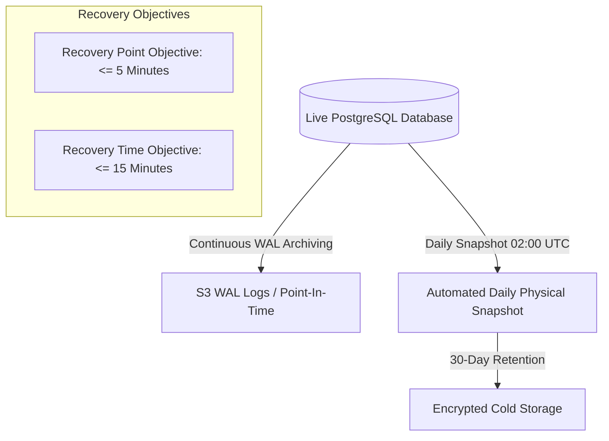

# 🔄 Phase 10: Disaster Recovery, Backup & Incident Response Plan

## 1. Database Backup & Retention Architecture

### 1.1 Snapshot Cadence & Tooling
- **Daily Physical Dumps**: `pg_dump -Fc -Z 6 -d razorpay_ecommerce` scheduled via cron at `02:00 UTC`.
- **WAL Archiving**: Continuous WAL segment archiving to secure cloud object storage.
- **Retention Policy**:
  - Daily backups: 30 days.
  - Weekly backups: 90 days.
  - Monthly archives: 1 year.
  - Immutable AI Action & Purchase Order Event Ledgers: Permanent (zero TTL deletion).

---

## 2. Migration Rollback Strategy

Every schema migration script in `data/` includes explicit rollback statements:
- `data/phase9_migration.ts`: Can be rolled back by dropping `merchant_onboarding_profile`, `merchant_system_notifications`, `merchant_data_imports` and associated composite indexes.
- All migrations are idempotent (`CREATE TABLE IF NOT EXISTS`, `CREATE INDEX IF NOT EXISTS`).

---

## 3. Incident Severity Levels & Response Protocols

| Severity | Definition | Target Response SLA | Action Protocol |
| :--- | :--- | :--- | :--- |
| **SEV-1 (Critical)** | Core database down, checkout blocked, or unauthorized data mutation detected. | < 15 Minutes | 1. Activate failover read-replica / PITR restore. 2. Freeze external webhook listeners. 3. Engage security on-call. |
| **SEV-2 (High)** | Merchant AI recommendations failing or Copilot offline; customer checkout unaffected. | < 1 Hour | 1. Switch Copilot to deterministic local heuristic fallback engine. 2. Check GROQ / AI provider rate limits. |
| **SEV-3 (Medium)** | Background sync delayed or notification queue backlogged. | < 4 Hours | 1. Drain queue workers. 2. Review composite index query performance. |
