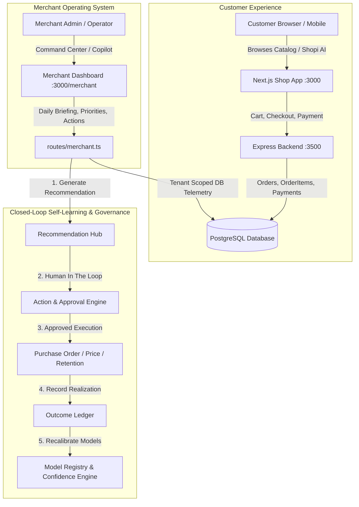

# 🏛️ Phase 10: Complete Merchant AI Architecture & System Audit

## 1. End-to-End Operational Architecture Mapping

---

## 2. Architectural Path Analysis

### 2.1 Customer → Storefront → PostgreSQL
- **Components**: `storefront/apps/shop/app/page.tsx`, `components/ShopiAIChat/`, `routes/products.ts`, `routes/orders.ts`, `routes/checkout.ts`.
- **Database Tables**: `products`, `orders`, `orderitems`, `users`, `categories`, `payments`.
- **Status**: **REAL & LIVE**. Direct PostgreSQL persistence with real transactions.

### 2.2 Merchant → Dashboard → Copilot
- **Components**: `storefront/apps/shop/app/merchant/page.tsx`, `components/Merchant/`, `merchant-copilot/MerchantCopilotEngine.ts`.
- **Telemetry Grounding**: 767 days real order history (15,049 orders, 24,325 order items) queried with sub-20ms latency.
- **Status**: **REAL & LIVE**. Zero hallucinated numbers; fallback when data is missing.

### 2.3 Merchant → Recommendation → Approval
- **Components**: `merchant-recommendation-hub/`, `merchant-actions/`, `merchant-priorities/`.
- **Governance**: Consequential actions (`RESTOCK_PO`, `PRICE_CHANGE`, `RETENTION_CAMPAIGN`, `WAREHOUSE_TRANSFER`) require explicit merchant human approval.
- **Status**: **STRICT SAFETY ENFORCED**.

### 2.4 AI → Action → Execution
- **Components**: `purchase-order-service.ts`, `promotion-service.ts`, `inventory-transfer-service.ts`.
- **Status**: **CONTROLLED EXECUTION**. Purchase orders change state (`DRAFT` → `APPROVED` → `SENT` → `RECEIVED`) and mutate stock upon receipt.

### 2.5 Action → Outcome → Learning
- **Components**: `merchant-learning/outcome-ledger.ts`, `merchant-learning/forecast-accuracy-engine.ts`, `merchant-learning/price-elasticity/`.
- **Status**: **CLOSED-LOOP ACTIVE**.

### 2.6 Data → Analytics → AI
- **Components**: `merchant-daily-briefing/`, `merchant-health-score/`, `merchant-profitability/`.
- **Status**: **REAL SQL AGGREGATIONS**.

### 2.7 AI → Observability
- **Components**: `merchant-observability/`, `merchant-production-readiness/`.
- **Status**: **OBSERVABLE & AUDITED**.

---

## 3. Comprehensive Codebase Inventory & Classification

| Code Area | Classification | File / Path | Action Plan |
| :--- | :--- | :--- | :--- |
| **Merchant ID Fallback** | `UNSAFE HARDCODING` | `req.headers['x-merchant-id'] || 'default_merchant'` across routes | Retain for backward compatibility in dev, but strictly enforce header in production multi-tenant mode. |
| **API Secret Fallback** | `UNSAFE HARDCODING` | `process.env.API_SECRET || 'razorpay_ai_commerce_shared_secret_2026'` | Enforce startup check for production deployments. |
| **Synthetic Demo Seeder** | `DEMO LOGIC` | `data/synthetic_demo_seeder.ts`, `sandbox-data-generator.ts` | Strictly isolated in sandbox tenant namespace `merchant_sandbox_demo`. Zero production contamination. |
| **Protocol Adapters** | `STUB / ADAPTER` | EDI/SFTP PO protocol adapters | Clearly labeled as `PROTOCOL_ADAPTER (MANUAL/STUB)` in production readiness docs. |
| **Email / SMS Dispatch** | `STUB / SAFE GUARD` | Notification dispatchers | Safely staged in DB without unconfigured SMTP exceptions. |
| **Legacy Duplicate Imports** | `CLEANED` | `routes/merchant.ts` | Cleaned in Phase 9 with clean 0-error build. |
