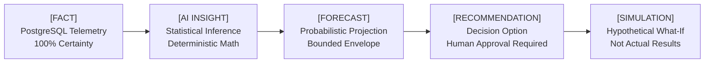

# 🏷️ Phase 11: Merchant AI Trust & Cognitive Badge Taxonomy

## 1. The 5-Tier Data Certainty Taxonomy

To prevent merchant confusion and ensure full transparency, every piece of information rendered in the Merchant AI dashboard and Copilot chat is labeled with an explicit certainty classification:

---

## 2. Classification Specifications

| Badge | Visual Styling | Definition | Example in UI |
| :--- | :--- | :--- | :--- |
| `[FACT]` | `bg-slate-100 text-slate-800 border-slate-300` | Historical or ledger data recorded directly in the PostgreSQL database. | **`[FACT]`** ₹80,58,272 gross revenue recorded across 1,053 orders. |
| `[AI INSIGHT]` | `bg-blue-50 text-blue-800 border-blue-200` | Deterministic computation or trend analysis synthesized from database facts. | **`[AI INSIGHT]`** Order volume grew +8.6% WoW while average discount depth increased by 3.2%. |
| `[FORECAST]` | `bg-purple-50 text-purple-800 border-purple-200` | Statistical projection bounded by a calibrated uncertainty envelope (min/mid/max). | **`[FORECAST]`** Projected 14-day demand: 45 units (Range: 38–52 units, 88% confidence). |
| `[RECOMMENDATION]` | `bg-amber-50 text-amber-800 border-amber-200` | Actionable commercial proposal requiring explicit human merchant approval before mutation. | **`[RECOMMENDATION]`** Restock 50 units of Sports Claw Shoes from Apex Apparel. |
| `[SIMULATION]` | `bg-cyan-50 text-cyan-800 border-cyan-200` | Hypothetical scenario output exploring parameter variations. | **`[SIMULATION]`** 10% price markdown may lift projected sales velocity by 12%. |

---

## 3. Data Freshness & Low-Data Fallback Rules

1. **Telemetry Freshness**: All metrics include a timestamp indicator (e.g. `Live • Updated 30s ago`).
2. **Confidence Grounding**: If sample size is < 30 observations, confidence is capped at `LOW` and labeled: `Limited historical data — prediction reliability reduced.`
3. **Missing Data Transparency**: When external integrations (like ad network pixels) are unconfigured, state is labeled: `NOT_CONFIGURED (Opportunity-based allocation)` without fabricating ROAS metrics.
