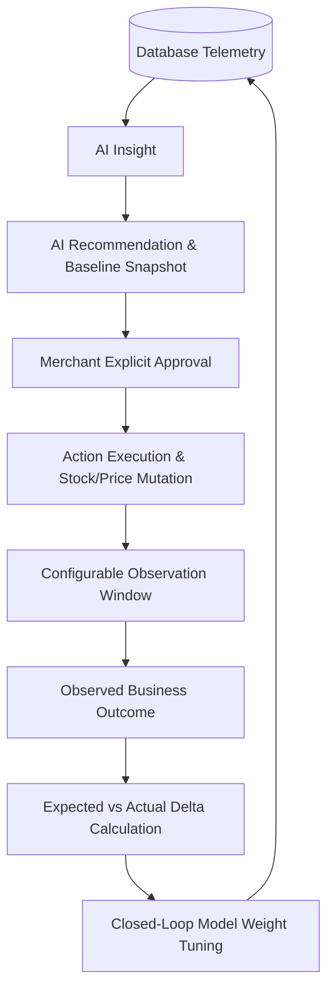

# 📊 Phase 12: Business Impact & Outcome Measurement

## 1. Executive Summary

Phase 12 closes the loop between AI intelligence, merchant approvals, and real-world financial results. The system has evolved from:

```
DATA → INSIGHT → RECOMMENDATION → ACTION
```

into a **Closed-Loop Business Impact Engine**:



---

## 2. Business Value Attribution & Methodology Safeguards

To prevent exaggerated claims and preserve merchant trust, the system adheres to strict attribution rules:
1. **Never Claim Unsupported Direct Causality**: The UI uses phrases such as:
   - *"Observed revenue increase following AI recommendation: ₹X"*
   - *"Estimated incremental contribution: ₹Y"*
   rather than *"The AI generated ₹X"*.
2. **Margin-Aware Negative Outcome Evaluation**:
   - If a discount recommendation generates +20% revenue but contribution margin collapses by >8% (e.g. from 48% to 32%), the action is classified as **`NEGATIVE`**.
3. **No Metric Fabrication**:
   - If product cost data (COGS) is missing, the system explicitly reports:
     *"Profit impact unavailable because product cost data is missing."*
