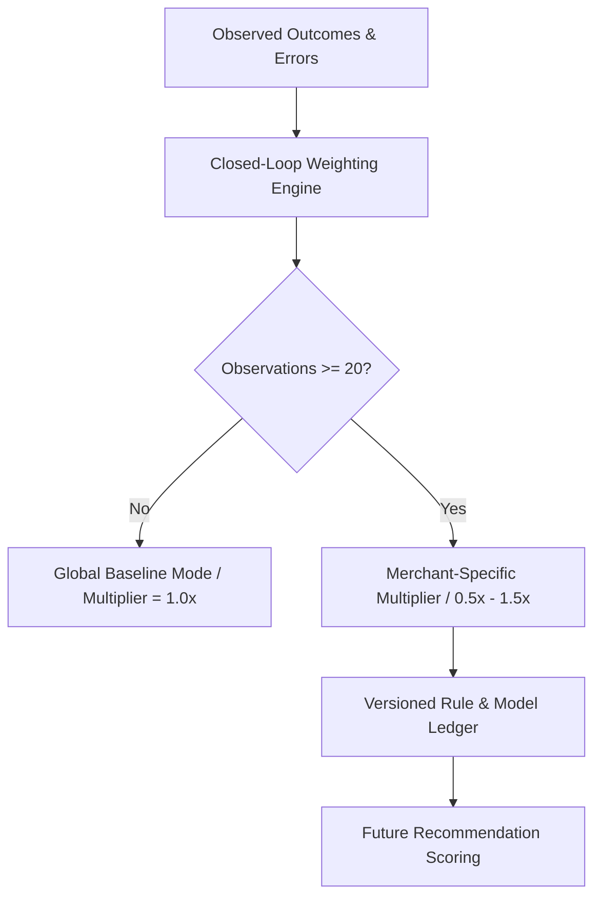

# 🧠 Phase 12: Closed-Loop Learning & Model Versioning System

## 1. Bounded Closed-Loop Learning Architecture

### 1.1 Minimum Observation Guard (Cold Start)
- **< 20 Evaluated Observations**: Merchant operates in `GLOBAL_BASELINE_COLD_START` mode with static `1.0x` baseline multipliers.
- **>= 20 Evaluated Observations**: Gradually tunes into `MERCHANT_SPECIFIC_TUNED` mode.

### 1.2 Bounded Adaptability (0.5x to 1.5x)
To prevent extreme volatility or model collapse, learned multipliers are bounded between `0.5x` (50% reduction in weight for historically poor recommendations) and `1.5x` (50% boost for high-performing recommendations).

---

## 2. Versioning Specification
Every recommendation carries explicit version tags:
- `model_version`: e.g. `v1.4_neural_demand`
- `rule_version`: e.g. `v2.4_adaptive`
- `feature_version`: e.g. `v1.2_leadtime`
