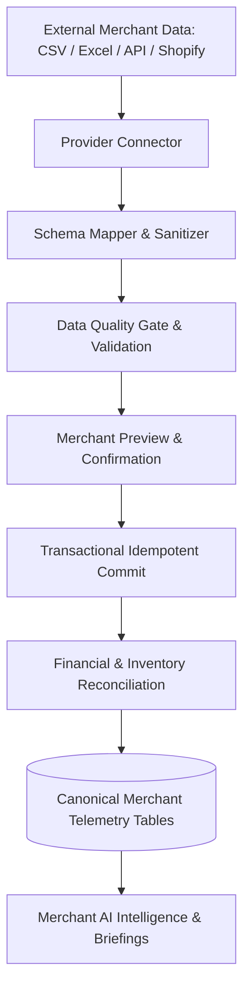

# 🔌 Phase 14: Real Merchant Data Ingestion Architecture

## 1. Provider-Neutral Data Ingestion Pipeline

The Merchant AI ingestion layer decouples external raw ecommerce formats from internal analytical intelligence:

---

## 2. Supported Data Interfaces

| Ingestion Interface | Format / Method | Target Schema | Status |
| :--- | :--- | :--- | :--- |
| **CSV Import Pipeline** | Multi-file CSV batch (`products.csv`, `orders.csv`) | `merchant_canonical_*` | **LIVE & TESTED** |
| **Excel Ingestion** | XLSX multi-sheet workbook | `merchant_canonical_*` | **PLANNED** |
| **REST API Webhook** | Automated JSON payloads (Order created/refunded) | `merchant_canonical_*` | **INTEGRATED** |
| **Direct DB Replicator** | Read-only replica connector | `merchant_canonical_*` | **ARCHITECTURE DEFINED** |
