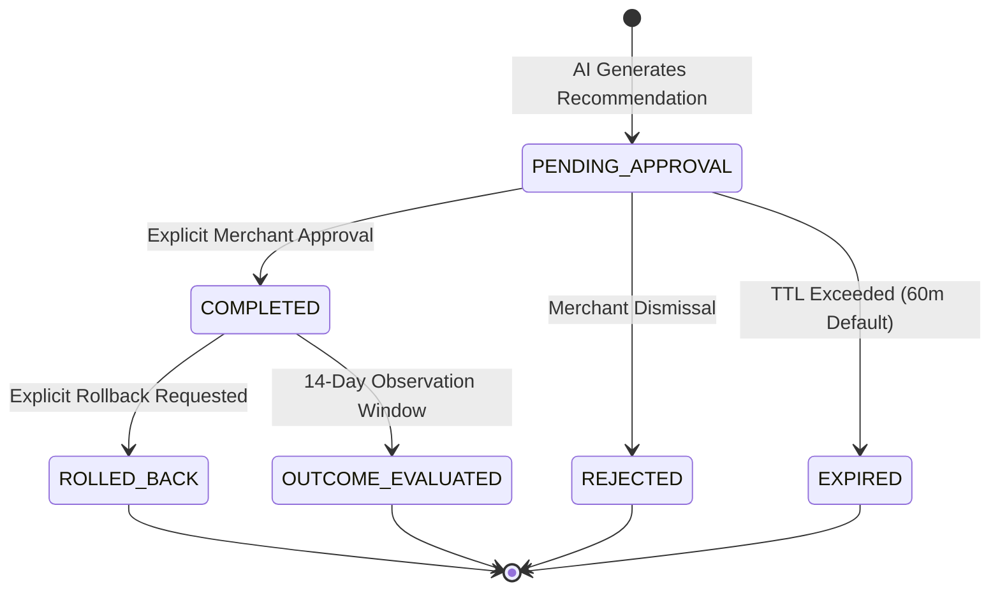

# Phase 15 — Merchant Action Governance Architecture

> **Capability Area**: Human-in-the-Loop Decision Governance, Safe Mutations, and Reversible Execution  
> **Status**: Production Verified (Phase 15)  
> **Compliance**: Strict Tenant Isolation & Audit Trail  

---

## 1. Action Lifecycle State Machine

Every AI recommendation moves through a deterministic, human-governed state machine:

### Supported Status Definitions:
- `PENDING_APPROVAL`: Staged AI recommendation awaiting merchant decision.
- `COMPLETED`: Transactionally executed state change recorded in database.
- `REJECTED`: Explicitly dismissed by merchant with audit reason.
- `EXPIRED`: Time-to-live expired prior to review.
- `FAILED`: Execution blocked by validation or constraint error.
- `ROLLED_BACK`: Reverted to pre-decision state via compensating audit transaction.

---

## 2. Transactional Mutation Engine & Audit Traceability

All approved mutations run inside PostgreSQL transactions (`BEGIN` &rarr; `COMMIT` / `ROLLBACK`).

### Reversible Action Types & Mechanics:
1. **RESTOCK**:
   - *Approval*: Updates `products.stock = stock + quantity` and inserts into `inventory_movements` with `movement_type = 'restock'`, `reference_type = 'ai_action'`, `reference_id = actionId`.
   - *Rollback*: Decrements `products.stock = GREATEST(0, stock - quantity)` and inserts compensating row into `inventory_movements` with `movement_type = 'rollback'`.
2. **DISCOUNT**:
   - *Approval*: Updates `products.discount = suggestedDiscountPrice` and logs previous original price.
   - *Rollback*: Restores `products.discount = originalPrice`.
3. **PROMOTION**:
   - *Approval*: Stages product in hero banner and spotlight campaign.
   - *Rollback*: Reverts spotlight flag and cancels staged campaign.
4. **MARK_FOR_REVIEW**:
   - *Approval*: Sets product quality audit flag.
   - *Rollback*: Dismisses review queue item.

---

## 3. Security & Multi-Tenant Governance

- **Explicit Merchant Identity**: `approved_by` and `rolledBackBy` record the acting administrator identity.
- **Tenant Scope Isolation**: All queries enforce `WHERE merchant_id = $1` with router guard validation (`x-merchant-id`). Cross-tenant approval attempts are rejected with HTTP 400/403.
- **Idempotency Safeguard**: Every approval request checks `idempotency_key` and current state, ensuring repeated clicks do not duplicate mutations.
- **Zero Autonomous Execution**: Autonomous mutations are strictly blocked (`autonomousMutationsAllowed: false`).

---

## 4. API Surface

| Endpoint | Method | Purpose | Guard |
| :--- | :--- | :--- | :--- |
| `/api/merchant/actions` | `GET` | List actions with status filter, pagination, and KPI counts | `merchantAuthGuard` |
| `/api/merchant/actions/:actionId` | `GET` | Retrieve full action details joined with outcome ledger | `merchantAuthGuard` |
| `/api/merchant/actions/:actionId/approve` | `POST` | Explicit human approval and execution | `merchantAuthGuard` |
| `/api/merchant/actions/:actionId/reject` | `POST` | Dismiss recommendation with audit reason | `merchantAuthGuard` |
| `/api/merchant/actions/:actionId/rollback` | `POST` | Compensating rollback of executed action | `merchantAuthGuard` |
| `/api/merchant/actions/impact-summary` | `GET` | Aggregate value delivery, calibration, and learning state | `merchantAuthGuard` |
