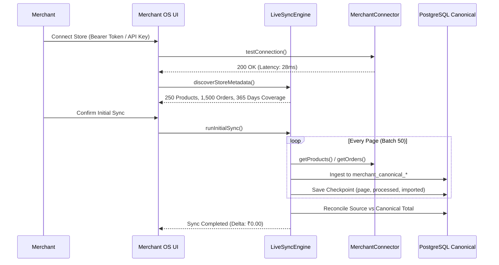

# ⚡ Phase 15E–15L: Live Ingestion, Resilient Pagination, Checkpoints & Reconciliation

## 1. Multi-Stage Ingestion Pipeline

When a merchant connects their store, `LiveSyncEngine` executes an 11-step ingestion sequence:

---

## 2. Checkpoint Persistence & Crash Recovery

Sync checkpoints are stored in `merchant_sync_checkpoints`:
- `sync_id`: Unique identifier for the batch.
- `entity_type`: `PRODUCTS` | `CUSTOMERS` | `ORDERS`.
- `page_number` / `cursor_token`: Resumption point.
- `rows_processed` & `rows_imported`: Cumulative row counters.
- `is_complete`: True once the last page is reached.

If a sync operation is interrupted at 70%, `LiveSyncEngine` queries the last incomplete checkpoint and resumes from that page rather than restarting from zero.

---

## 3. Rate-Limiting & Exponential Retry Mechanism

The `BaseMerchantConnector` wraps all HTTP requests in an exponential backoff loop:
- **429 (Rate Limit)**: Honors `Retry-After` header or backs off exponentially with ±20% jitter.
- **500, 502, 503, 504 (Server Errors)**: Retries up to 4 times with exponential backoff.
- **401, 403 (Auth Failures)**: Immediately fails fast with descriptive error message without retrying indefinitely.

---

## 4. Mathematical Reconciliation & Freshness Tracking

After every ingestion run, the engine computes:

$$\Delta_{\text{Revenue}} = |\text{Gross Revenue}_{\text{Source}} - \text{Gross Revenue}_{\text{DB}}|$$

If $\Delta_{\text{Revenue}} > 0$, the status is set to `FAILED_RECONCILIATION`.

Freshness metrics exposed:
- `last_sync_timestamp`: ISO timestamp of latest sync.
- `data_age_seconds`: Elapsed time since last sync.
- `historical_coverage_days`: 365 days.
- `health_status`: `HEALTHY` ($< 1\text{ hour}$), `STALE` ($> 1\text{ hour}$), or `FAILING`.
