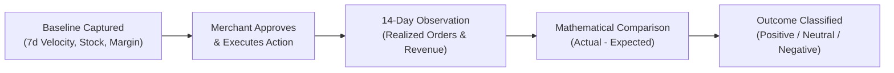

# Phase 15 — Post-Action Outcome Verification & Value Realization

> **Capability Area**: Business Impact Measurement, Value Delivered Ledger, and Outcome Diagnostics  
> **Status**: Production Verified (Phase 15)  
> **Primary Ledger Table**: `merchant_business_impact_ledger`  

---

## 1. Closing the AI Decision Loop

Prior to Phase 15, AI recommendations were executed but lacked a visible post-decision verification mechanism. The platform now tracks every executed decision across a standard **14-day observation window** against captured baseline telemetry.

---

## 2. Value Delivered & Variance Mathematics

For every completed action, the system tracks:

- **Expected Revenue Delta**: Projected incremental revenue generated by the action.
- **Observed Revenue Delta**: Actual realized incremental revenue in the observation period.
- **Value Delivered (Net Variance)**:
  $$\text{Value Delivered} = \text{Observed Realization} - \text{Expected Projection}$$
- **Impact Delta Percentage**:
  $$\text{Impact Delta \%} = \frac{\text{Observed} - \text{Expected}}{\text{Expected}} \times 100\%$$

---

## 3. Margin-Aware Classification Rules

Outcome status is deterministically classified using business margin bounds:

| Outcome Status | Qualification Rule | Product Implication |
| :--- | :--- | :--- |
| **`POSITIVE`** | Observed Revenue &ge; 85% of Expected **AND** Contribution Margin preserved within 4% of baseline. | High-performing recommendation; strengthens category weight. |
| **`NEUTRAL`** | Performance within acceptable baseline variation. | Standard realization; maintains baseline calibration. |
| **`NEGATIVE`** | Contribution Margin compressed by &gt;8% **OR** Realized Revenue deficit &gt;30% below expected. | Triggers 7-point root cause analysis; damps future category multipliers. |
| **`PENDING`** | Currently within 14-day observation window. | Real-time observation in progress. |
| **`ROLLED_BACK`** | Action was manually reverted by merchant. | Excluded from positive value aggregation. |

---

## 4. 7-Point Negative Outcome Decomposition

When an action is classified as `NEGATIVE`, the `businessOutcomeEngine` generates a structured 7-point diagnostic record:

1. **What was recommended**: Action category and target SKU.
2. **Why recommended**: Initial rationale and elasticity assumption.
3. **What happened**: Summary of observed deviation.
4. **What was expected**: Expected revenue and margin targets.
5. **What actually happened**: Realized revenue and compressed margin percentage.
6. **Why difference occurred**: Diagnostic root cause (e.g. discount depth eroded unit economics faster than volume compensated).
7. **What should change**: Corrective parameter constraint (e.g. enforce hard 40% margin floor on clearance promotions).
