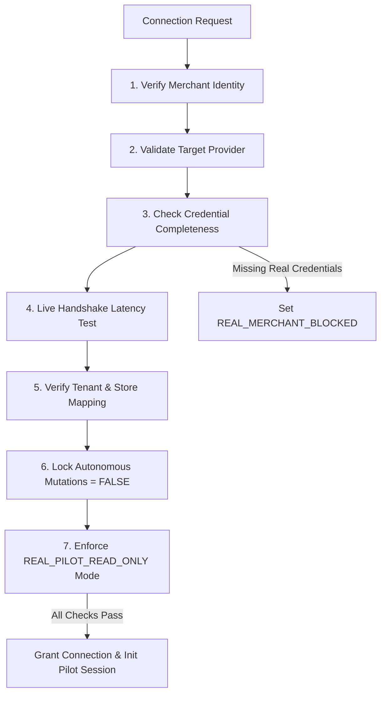

# 👑 Phase 16B & 16H–16J: Production Pilot Architecture, Connection Gate & Safety Model

## 1. The 7-Point Production Connection Gate

Before allowing any external platform connection to synchronize data, `PilotGateService` enforces a strict 7-point pre-flight validation gate:

---

## 2. Pilot Safety Constraint: `REAL_PILOT_READ_ONLY`

The pilot operating environment enforces hardcoded read-only constraints:

| System Capability | Pilot State | Execution Behavior |
| :--- | :---: | :--- |
| **Catalog & Order Reading** | ✅ **ALLOWED** | Ingests canonical orders, products, customers |
| **Business Analytics & Copilot** | ✅ **ALLOWED** | Computes mathematical aggregates, AOV, returns |
| **Demand Forecasting & What-If**| ✅ **ALLOWED** | Simulates scenarios and generates predictions |
| **Action Card Recommendations**| ✅ **ALLOWED** | Generates `PENDING_APPROVAL` cards in UI |
| **Autonomous Price Changes** | ❌ **FORBIDDEN** | Blocked at service level by `PilotModeGuard` |
| **Autonomous Restock Orders** | ❌ **FORBIDDEN** | Blocked at service level by `PilotModeGuard` |
| **Autonomous Discount Creation** | ❌ **FORBIDDEN** | Blocked at service level by `PilotModeGuard` |

---

## 3. Human-in-the-Loop Explicit Approval Workflow

When an operational action is recommended:
1. **Generation**: Copilot or proactive engine writes a `PENDING_APPROVAL` record to `merchant_ai_actions`.
2. **Review**: Merchant reviews the recommendation card displaying: Reason, Evidence, Confidence Score, Expected Business Impact, Risk Level, and Data Freshness.
3. **Revalidation**: Upon clicking **Approve**, the validator re-queries live inventory and catalog state to ensure conditions haven't drifted.
4. **Execution**: Transaction executes and updates the action status to `COMPLETED` with `approved_by` signature.
5. **Outcome Tracking**: Outcome learner observes subsequent 7–14 day telemetry to compute realized revenue lift.
