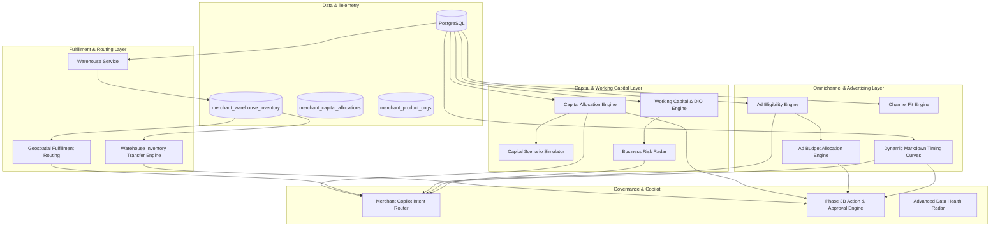

# Phase 6 System Audit: Merchant AI Omnichannel Commerce & Capital Allocation Engine

**Date:** 2026-08-24  
**Workspace:** `d:/Razorpay-Ai-Commerce`  
**Target:** Omnichannel Operating System, Multi-Warehouse Fulfillment & Capital Allocation Architecture Audit

---

## 1. System Foundation & Existing Capabilities

| Phase | Subsystem | Status | Reusable Components in Phase 6 |
| :--- | :--- | :---: | :--- |
| **Phase 2** | Dashboard Analytics | Active | Sales rollups, Product rankings, Category performance |
| **Phase 3A** | Merchant Copilot | Active | Natural-language query classifier, Intent dispatch, Period resolver |
| **Phase 3B** | Action & Approval Engine | Active | `merchant_ai_actions`, Human approval workflow, Idempotency |
| **Phase 3C** | Proactive Intelligence | Active | Anomaly radar, Alert deduplication, PO document generator |
| **Phase 4** | Optimization & Forecasting | Active | Moving average demand forecasting, Elasticity, A/B experiments |
| **Phase 5** | Supplier & Decision Engine | Active | Supplier master, PO state machine, Cannibalization matrix, CLV model, Top 3 Priorities |

---

## 2. Existing Database Schema
- **Catalog & Orders**: `products` (40 SKUs), `categories`, `orders` (15,049 records over 767 days), `orderitems` (24,325 items), `inventory_movements` (25,701 ledger records).
- **Customers**: `users` (658 accounts), `order_returns` (1,175 records), `order_cancellations` (356 records).
- **AI Core**: `merchant_ai_actions`, `merchant_ai_alerts`, `merchant_ai_digests`, `merchant_ai_coupons`, `merchant_ai_recommendations`, `merchant_ai_simulations`, `merchant_ai_experiments`, `merchant_ai_outcomes`.
- **Phase 5 Additions**: `merchant_suppliers`, `merchant_purchase_orders`, `merchant_purchase_order_events`, `merchant_supplier_performance`, `merchant_cannibalization`, `merchant_customer_value`, `merchant_decisions`.

---

## 3. Existing Limitations & Missing Capabilities in Phase 5
1. **Single-Node Inventory Assumption**: Inventory stock was maintained only at the catalog level (`products.stock`), with no regional warehouse nodes or geospatial shipping routing.
2. **Capital Allocation Void**: The system answered *"What product needs restock?"* but lacked an algorithmic engine to answer *"Where should I allocate my next ₹1,00,000 of available capital across inventory, retention, advertising, and cash reserves?"*.
3. **Advertising Intelligence Gap**: No criteria or guardrails existed to prevent advertising low-stock SKUs, high-return items, or substitute items that cannibalize core lines.
4. **Static Discounting vs Dynamic Timing Curves**: Promotions calculated discount percentages, but lacked inventory age brackets ($0-30\text{d}$, $31-60\text{d}$, $61-90\text{d}$, $91+\text{d}$) to determine *when* to markdown.
5. **COGS Field Missing**: Products catalog lacked unit procurement cost data; margin optimization must remain safely disabled unless user supplies COGS.

---

## 4. Phase 6 Architectural Modules & Integration Blueprint

---

## 5. Non-Negotiable Safety & Transparency Rules
- **No Fake Integrations**: Google Ads, Meta Ads, Amazon, and live carrier APIs are explicitly marked as `NOT_CONFIGURED` without claiming real API calls.
- **No Fake ROAS or Conversion**: Budget allocations are strictly opportunity-scored rather than fabricated ROAS.
- **No Fake COGS / Margins**: If COGS is missing, the system transparently reports `INSUFFICIENT` and defaults to revenue/unit optimization.
- **Human Approval Mandatory**: All warehouse transfers, capital investments, ad budgets, and markdown schedules create `PENDING_APPROVAL` records in `merchant_ai_actions`.
