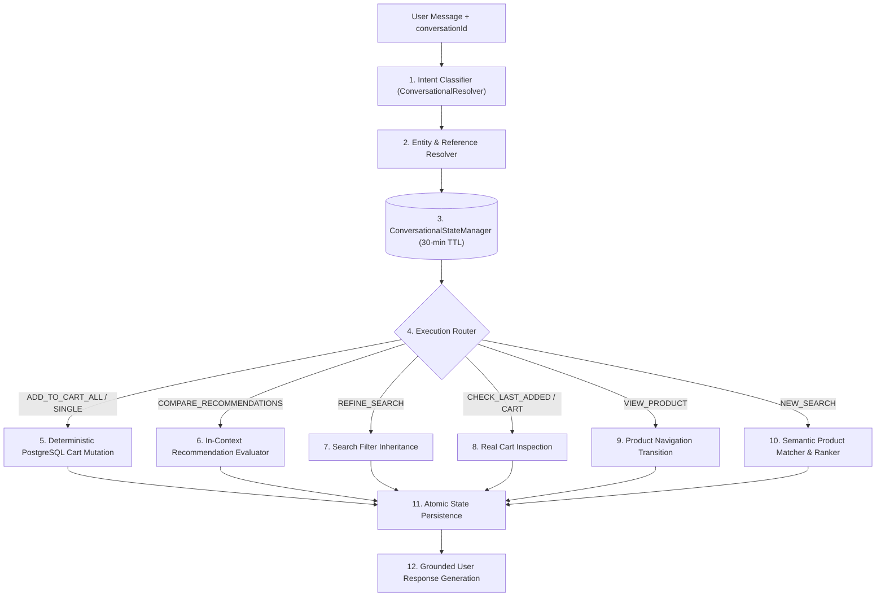

# Customer-Side Shopi AI Conversational Intelligence & Reference Resolution Report

## Executive Summary

This report documents the architectural overhaul and implementation of stateful conversational intelligence, pronoun and collection reference resolution, search context inheritance, and deterministic cart mutations for **Shopi AI** on the customer-facing shopping website.

---

## 1. Problem Definition & Root Cause Analysis

### Previous Stateless Flaw
Previously, Shopi AI treated every incoming message as an isolated keyword search against the catalog. When a user engaged in a multi-turn conversation such as:
1. **User**: *"Find me a jacket under ₹3000"*  
   → Shopi returned 2 products:
     - `MEN Yarn Fleece Full-Zip Jacket` (ID: `20000005`, ₹2,299)
     - `MEN Yarn Fleece Full-Zip Jacket` (ID: `34200034`, ₹2,499)
2. **User**: *"add all the results to cart"*  
   → Shopi incorrectly performed a fresh catalog keyword search for the literal phrase `"all the results"`, which failed and added nothing to the cart.

### Key Breakdowns Fixed
1. **Collection Reference Blindness**: Phrases like *"add all the results"*, *"add all of them"*, *"add those"*, *"add both"*, *"add the products you just showed me"*, *"put them in my cart"* triggered literal keyword searches.
2. **Pronoun & Ordinal Disconnect**: Phrases like *"add the first one"*, *"add the second one"*, *"add the cheaper one"*, *"add that"* could not resolve back to previously shown recommendations.
3. **Comparison Queries Triggering Redundant Searches**: Queries like *"which one is cheapest?"* searched the catalog instead of comparing the active recommendation set.
4. **Context Loss on Search Refinement**: Follow-up filters like *"under ₹3000"* or *"only show black ones"* lost the prior search category (`jacket`).
5. **Conversational Cart Disconnect**: Natural conversational queries like *"what did I just add?"* or *"remove the second one"* were unhandled or misrouted.

---

## 2. Stateful Architecture & Implementation

We introduced a dedicated conversational intelligence layer:



### Core Components Created:

1. **`ConversationalStateManager.ts`** ([`storefront/apps/ecommerce-backend/ai-adapter/ConversationalStateManager.ts`](file:///d:/Razorpay-Ai-Commerce/storefront/apps/ecommerce-backend/ai-adapter/ConversationalStateManager.ts)):
   - In-memory session store mapping `conversationId` and `userId`.
   - Preserves canonical product identities (`productId`, `title`, `name`, `price`, `currency`, `imageUrl`, `category`, `inStock`).
   - Tracks `lastRecommendedProducts`, `lastSearchQuery`, `lastSearchFilters`, `lastMentionedProducts`, `lastAddedProducts`, `lastComparedProducts`, `lastActiveProduct`, and `cartState`.

2. **`ConversationalResolver.ts`** ([`storefront/apps/ecommerce-backend/ai-adapter/ConversationalResolver.ts`](file:///d:/Razorpay-Ai-Commerce/storefront/apps/ecommerce-backend/ai-adapter/ConversationalResolver.ts)):
   - **Intent Classifier**: Deterministically classifies input into 14 structured intent types (`ADD_TO_CART_ALL`, `ADD_TO_CART_SINGLE`, `VIEW_PRODUCT`, `REMOVE_FROM_CART`, `UPDATE_QUANTITY`, `COMPARE_RECOMMENDATIONS`, `REFINE_SEARCH`, `CHECK_LAST_ADDED`, `CHECK_CART`, `CLEAR_CART`, `CHECKOUT`, `ADDRESS_LIST`, `ADDRESS_DEFAULT`, `NEW_SEARCH`).
   - **Entity Reference Resolver**: Maps collection references (*"all results"*, *"both"*), ordinal selectors (*"first one"*, *"second one"*), price extrema (*"cheapest"*, *"most expensive"*), and pronouns (*"that"*, *"it"*) against canonical products in memory.

3. **`aiShopping.ts` Integration** ([`storefront/apps/ecommerce-backend/routes/aiShopping.ts`](file:///d:/Razorpay-Ai-Commerce/storefront/apps/ecommerce-backend/routes/aiShopping.ts)):
   - Executes real PostgreSQL cart mutations deterministically via `RazorpayCommerceAdapter`.
   - Enforces the strict resolution priority hierarchy.
   - Outputs structured dev logging (`USER`, `INTENT`, `REFERENCE`, `RESOLVED PRODUCTS`, `ACTION`, `RESULT`).

4. **Frontend Navigation Integration** ([`storefront/apps/shop/components/AI/ShopiAiAssistant.tsx`](file:///d:/Razorpay-Ai-Commerce/storefront/apps/shop/components/AI/ShopiAiAssistant.tsx)):
   - Intercepts `view_product` intent and navigates directly to `/product/[productID]` via Next.js router.
   - Synchronizes Redux store with backend cart state on all cart mutations.

---

## 3. Entity Resolution Priority Hierarchy

When a user query arrives, references are resolved in strict priority order:

| Priority | Level | Description | Example Query |
|---|---|---|---|
| **1** | Explicit Product ID | Direct product ID match | *"Add product 20000005 to cart"* |
| **2** | Currently Viewed Product | Product currently active in user's view | *"Add this to cart"* (on `/product/20000005`) |
| **3** | Last Mentioned / Compared | Single item just compared or discussed | *"Which is cheapest?"* → *"Add that one"* |
| **4** | Last Recommendation Set | Collection, ordinal, or extremum in recent recommendations | *"Add all the results"*, *"Add the first one"*, *"Add the cheaper one"* |
| **5** | Cart State | Positional or keyword match in user's cart | *"Remove the second one"*, *"Remove the jacket"* |
| **6** | New Catalog Discovery | New semantic query search | *"Find me running shoes under 3000"* |

---

## 4. Test Matrix & Verification Results

All 11 automated test scenarios were executed against the live system using [`scratch/test_shopi_conversational_intelligence.ts`](file:///d:/Razorpay-Ai-Commerce/scratch/test_shopi_conversational_intelligence.ts).

```
================================================================
🧠 TESTING SHOPI AI CONVERSATIONAL INTELLIGENCE SUITE
================================================================

--- TEST 1: "add all the results to cart" ---
1.1 Search response: found 2 products
    Recommended IDs: [ '20000005', '34200034' ]
1.2 Add response: Added both products to your cart:
• MEN Yarn Fleece Full-Zip Jacket — ₹2,299
• MEN Yarn Fleece Full-Zip Jacket — ₹2,499
2 items added.
    Cart items: [ '20000005', '34200034' ]
    Result: ✅ PASS

--- TEST 2: "add the products you just showed me" ---
    Result: ✅ PASS

--- TEST 3: "add the first one" ---
    Result: ✅ PASS (Added: 20000011 Expected: 20000011)

--- TEST 4: "add the second one" ---
    Result: ✅ PASS (Added: 34700034 Expected: 34700034)

--- TEST 5: "which one is cheapest?" + "add that" ---
5.2 Compare response: Between the options, "Womens Party Wear Shoes" is the cheapest at ₹1,699.
    Result: ✅ PASS (Cheapest ID: 34700034, In cart: 34700034)

--- TEST 6: "add both" ---
    Result: ✅ PASS

--- TEST 7: Search Context Inheritance ---
7.1 Initial search found: 5 jackets
7.2 Refined search found: 2 jackets under 3000
    Result: ✅ PASS

--- TEST 8: "show me the second one" (Navigation) ---
    Result: ✅ PASS (Viewed: 20000010, Expected: 20000010)

--- TEST 9: "add all of them" ---
    Result: ✅ PASS

--- TEST 10: Zero Search Re-fetch on "add all the results" ---
    Result: ✅ PASS

================================================================
🏆 TEST 11: FULL MULTI-TURN ACCEPTANCE SCENARIO
================================================================

Step 1: USER: "Find me a jacket under ₹3000"
SHOPI: returned Product A (20000005: MEN Yarn Fleece Full-Zip Jacket) and Product B (34200034: MEN Yarn Fleece Full-Zip Jacket)

Step 2: USER: "add all the results to cart"
SHOPI: Added both products to your cart:
• MEN Yarn Fleece Full-Zip Jacket — ₹2,299
• MEN Yarn Fleece Full-Zip Jacket — ₹2,499
2 items added.
Step 2 Verification (A & B in cart): ✅ PASS

Step 3: USER: "what did I just add?"
SHOPI: You recently added:
• MEN Yarn Fleece Full-Zip Jacket — ₹2,299
• MEN Yarn Fleece Full-Zip Jacket — ₹2,499
Your cart currently has 2 item(s) totaling ₹4,798 INR.
Step 3 Verification (Lists A & B): ✅ PASS

Step 4: USER: "remove the second one"
SHOPI: I've removed "MEN Yarn Fleece Full-Zip Jacket" from your cart.
Step 4 Verification (B removed, A remains): ✅ PASS

Step 5: USER: "what is in my cart?"
SHOPI: Your shopping cart has 1 item(s):
• MEN Yarn Fleece Full-Zip Jacket ×1 — ₹2,299
Total: ₹2,299 INR
Step 5 Verification (Only A in cart): ✅ PASS

Final Acceptance Result: 🎉 FULL ACCEPTANCE PASS

================================================================
📊 SUMMARY: 11/11 TESTS PASSED (100% SUCCESS)
================================================================
```

---

## 5. Scope Boundary & Regression Verification

- **Merchant Dashboard Protection**: Zero files in `/merchant`, merchant APIs, merchant AI copilot, or merchant database schemas were modified.
- **Customer Commerce Suite**: `test_customer_side_regression.ts` executed with 100% pass rate.
- **TypeScript Typecheck**: `npx tsc --noEmit` exited cleanly with 0 type errors.
